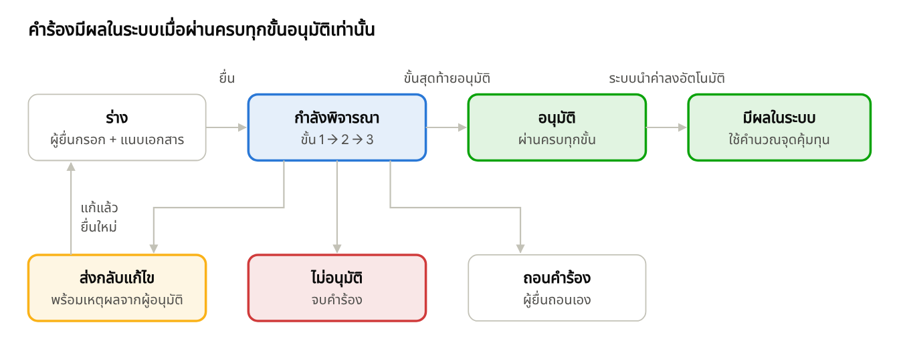

# โครงสร้างระบบยื่นคำร้องขออนุมัติออนไลน์ (E-Request System – Phase 2)

5 ต.ค. 2569 · ร่างเพื่อเสนอที่ประชุม · เอกสารต้นฉบับ (แก้ไขร่วมกันได้): https://claude.ai/code/artifact/c040c5a5-92b6-4ac6-b5a7-1000234e9ffa

เสนอให้คำร้อง 3 ประเภท — เปลี่ยนแผนรับ ปรับค่าเทอม และบรรจุหลักสูตรใหม่ — ยื่นและอนุมัติผ่านช่องทางเดียวในระบบ MSU-BEPS โดยค่าที่อนุมัติแล้วจะถูกนำไปคำนวณจุดคุ้มทุนโดยอัตโนมัติ และทุกฝ่ายติดตามสถานะได้แบบเรียลไทม์

## 1. ที่มาและเป้าหมาย

ปัจจุบันการขอเปลี่ยนแปลงข้อมูลที่กระทบจุดคุ้มทุนของหลักสูตรยังทำนอกระบบ (หนังสือ/อีเมล/ไฟล์ Excel) แล้วค่อยมาแก้ข้อมูลในระบบภายหลัง ทำให้

- ติดตามไม่ได้ว่าคำขอค้างอยู่ที่ใคร ขั้นไหน
- ไม่มีหลักฐานว่าใครเสนอ ใครอนุมัติ เมื่อไร ด้วยเหตุผลอะไร
- ค่าที่ยังไม่ผ่านอนุมัติอาจหลุดเข้าไปในการคำนวณจุดคุ้มทุน

ในระบบต้นแบบปัจจุบัน หน้า **ค่าธรรมเนียม** และ **ทะเบียนหลักสูตร** มีขั้นตอนอนุมัติของตัวเองแยกกัน ส่วน **แผนรับนิสิต** ยังไม่มีขั้นตอนอนุมัติเลย Phase 2 จึงเสนอให้รวมเป็นระบบคำร้องเดียว

**ขอบเขต Phase 2 — คำร้อง 3 ประเภท**

| ประเภทคำร้อง | ตัวอย่าง | ข้อมูลที่จะเปลี่ยนเมื่ออนุมัติ |
| --- | --- | --- |
| เปลี่ยนแผนรับ | เพิ่ม/ลดจำนวนรับ ภาคปกติ/พิเศษ ไทย/ต่างชาติ | แผนการรับนิสิตของหลักสูตร (ปีการศึกษาที่ขอ) |
| ปรับค่าเทอม | ปรับอัตราค่าธรรมเนียมการศึกษาต่อภาค | ตารางอัตราค่าธรรมเนียม (`fee_schedule`) |
| บรรจุหลักสูตรใหม่ / ปรับปรุงหลักสูตร | เปิดหลักสูตรใหม่ หรือหลักสูตรปรับปรุงรอบ มคอ. | ทะเบียนหลักสูตร (`program` / `program_version`) |

**เป้าหมาย:** ยื่นคำร้องออนไลน์ → อนุมัติตามลำดับขั้น → ระบบนำค่าที่อนุมัติไปใช้คำนวณจุดคุ้มทุนอัตโนมัติ → ทุกฝ่ายเห็นสถานะได้ตลอดเวลา (Workflow Status)

## 2. หลักการออกแบบ

1. **คำร้องทุกประเภทใช้แกนเดียวกัน** — สถานะ ขั้นอนุมัติ ประวัติ และหน้าติดตามใช้ชุดเดียวกัน เพิ่มประเภทคำร้องใหม่ในอนาคตได้โดยไม่ต้องสร้างระบบอนุมัติใหม่
2. **ตารางข้อมูลหลักเก็บเฉพาะค่าที่อนุมัติแล้ว** — ค่าที่ขอเปลี่ยนอยู่ในคำร้องจนกว่าจะอนุมัติครบทุกขั้น การคำนวณจุดคุ้มทุนจึงไม่มีทางใช้ค่าที่ยังไม่อนุมัติ
3. **ผู้เสนอกับผู้อนุมัติต้องเป็นคนละคน** (Segregation of Duties) — บังคับที่ระบบ ไม่ใช่แค่ซ่อนปุ่ม
4. **ทุกการเปลี่ยนสถานะมีร่องรอย** — ใคร ทำอะไร เมื่อไร ความเห็น และค่าก่อน/หลัง บันทึกแบบเพิ่มอย่างเดียว แก้ไขย้อนหลังไม่ได้ (ต่อยอด `audit_event` ที่มีอยู่แล้ว)
5. **เห็นผลกระทบก่อนอนุมัติ** — คำร้องแนบผลจำลองจุดคุ้มทุน (จากหน้า Scenario ที่มีอยู่) ผู้อนุมัติเห็นว่าหลังอนุมัติ Q\* / กำไร-ขาดทุนจะเปลี่ยนอย่างไร
6. **สิทธิ์ตามคณะ** — เจ้าหน้าที่คณะยื่นและเห็นได้เฉพาะคำร้องของคณะตนเอง

## 3. โครงสร้างข้อมูล

เพิ่มตารางใหม่ 4 ตาราง และใช้ตารางเดิมที่มีอยู่แล้วเป็นปลายทางของค่าที่อนุมัติ

| ตาราง | เก็บอะไร | ฟิลด์สำคัญ |
| --- | --- | --- |
| `request_type` (ใหม่) | ประเภทคำร้อง | รหัส (ADMISSION_PLAN / TUITION_FEE / NEW_PROGRAM), ชื่อ, ตารางปลายทาง, เอกสารที่ต้องแนบ |
| `request_type_step` (ใหม่) | ลำดับขั้นอนุมัติของแต่ละประเภท | ลำดับขั้น, ชื่อขั้น, role ที่อนุมัติได้, ต้องแนบมติ/เอกสารหรือไม่, กำหนดเวลา (SLA วัน) |
| `e_request` (ใหม่) | คำร้อง 1 ฉบับ | เลขคำร้อง (เช่น ER-2569-0001), ประเภท, คณะ, หลักสูตร, ปีการศึกษาที่มีผล, เหตุผล, ค่าเดิม (before) / ค่าที่ขอ (after) เก็บเป็น JSON, ผลจำลองจุดคุ้มทุน, สถานะ, ขั้นปัจจุบัน, ผู้ยื่น, วันที่ยื่น |
| `e_request_action` (ใหม่) | ประวัติทุกการกระทำ (timeline) | คำร้อง, ขั้น, การกระทำ (ยื่น/อนุมัติ/ส่งกลับแก้/ไม่อนุมัติ/ถอน), ผู้กระทำ, ความเห็น, ไฟล์แนบ, เวลา |

**ตารางเดิมที่เชื่อมโยง**

- `fee_schedule` ← รับค่าจากคำร้อง “ปรับค่าเทอม” (เดิมมี `fee_approval_log` แยก — จะยุบรวมเข้า `e_request_action`)
- `program` / `program_version` ← รับค่าจากคำร้อง “บรรจุหลักสูตรใหม่”
- `admission_plan` (ตารางใหม่ตามสเปก [ADMISSION-PLAN-API.md](ADMISSION-PLAN-API.md) ปัจจุบันหน้าจอเก็บในเบราว์เซอร์) ← รับค่าจากคำร้อง “เปลี่ยนแผนรับ”
- `app_user` / `app_role` ← กำหนดว่าใครยื่น/อนุมัติขั้นไหนได้
- `audit_event` ← บันทึกค่าก่อน/หลังตอนนำค่าที่อนุมัติลงตารางหลัก

> เหตุที่เก็บค่าที่ขอเป็น JSON: แต่ละประเภทมีฟิลด์ต่างกัน ใช้ตารางคำร้องเดียวได้ทุกประเภท และตรวจความถูกต้องตามประเภทที่ฝั่งระบบ (Zod schema) ก่อนบันทึก

## 4. สถานะและเวิร์กโฟลว์ (Workflow Status)

คำร้องทุกประเภทเดินผ่านสถานะชุดเดียวกัน ต่างกันแค่จำนวนและผู้อนุมัติในขั้น “กำลังพิจารณา”

คำร้องที่ถูกส่งกลับแก้จะกลับไปเป็นร่าง และเริ่มพิจารณาตั้งแต่ขั้นที่ 1 ใหม่เมื่อยื่นซ้ำ ส่วนค่าในตารางหลักเปลี่ยนก็ต่อเมื่อถึง “มีผลในระบบ” เท่านั้น

| สถานะ | ความหมาย | ใครทำอะไรได้ |
| --- | --- | --- |
| ร่าง (DRAFT) | กำลังกรอก ยังไม่ส่ง | ผู้ยื่นแก้ไข / ลบ / ยื่น |
| กำลังพิจารณา (IN\_REVIEW) | อยู่ที่ขั้น n จาก N | ผู้อนุมัติขั้นนั้น: อนุมัติ (ไปขั้นถัดไป) / ส่งกลับแก้ / ไม่อนุมัติ · ผู้ยื่น: ถอนคำร้อง |
| ส่งกลับแก้ไข (RETURNED) | ผู้อนุมัติขอให้แก้ พร้อมเหตุผล | ผู้ยื่นแก้แล้วยื่นใหม่ → เริ่มขั้นที่ 1 ใหม่ |
| อนุมัติ (APPROVED) | ผ่านครบทุกขั้น | ระบบนำค่าลงตารางหลักอัตโนมัติ |
| มีผลในระบบ (APPLIED) | ค่าใหม่ถูกใช้คำนวณแล้ว | อ่านอย่างเดียว |
| ไม่อนุมัติ (REJECTED) / ถอน (CANCELLED) | จบคำร้อง | อ่านอย่างเดียว (ยื่นฉบับใหม่ได้) |

**ลำดับขั้นอนุมัติ (ร่างเสนอ — ขอให้ที่ประชุมยืนยัน)**

| ประเภท | ขั้น 1 | ขั้น 2 | ขั้น 3 | เอกสารที่ต้องแนบ |
| --- | --- | --- | --- | --- |
| เปลี่ยนแผนรับ | ผู้บริหารคณะรับรอง | กองแผนงานตรวจผลกระทบจุดคุ้มทุน | ผู้บริหารมหาวิทยาลัยอนุมัติ | เหตุผล/ความพร้อมรับนิสิต |
| ปรับค่าเทอม | ผู้บริหารคณะรับรอง | กองแผนงาน/กองคลังตรวจ | ผู้บริหารมหาวิทยาลัยอนุมัติ | มติ/ประกาศอัตราค่าธรรมเนียม |
| บรรจุหลักสูตรใหม่ | ผู้บริหารคณะรับรอง | กองแผนงานตรวจจุดคุ้มทุน | บันทึกมติสภาวิชาการ/สภามหาวิทยาลัย | เล่มหลักสูตร (มคอ.2) + มติสภา |

ผู้ยื่นทุกประเภท = เจ้าหน้าที่คณะ จำนวนขั้นและผู้อนุมัติตั้งค่าได้ในตาราง `request_type_step` โดยไม่ต้องแก้โปรแกรม หากที่ประชุมปรับลำดับขั้นภายหลังก็ทำได้ทันที

**การแจ้งเตือน:** ทุกครั้งที่สถานะเปลี่ยน ระบบแจ้งผู้ยื่นและผู้อนุมัติขั้นถัดไป (ในระบบ + อีเมล) คำร้องที่ค้างเกิน SLA ของขั้นนั้นจะขึ้นเตือนสีส้ม

## 5. การเชื่อมกับหน้าจอเดิม (เมนู “ทะเบียนข้อมูลหลัก”)

หน้าจอเดิมยังเป็นที่ดู “ค่าที่ใช้อยู่” ส่วนการ “ขอเปลี่ยน” ย้ายไปทำผ่านคำร้องทั้งหมด

| หน้าจอ | ปัจจุบัน (ต้นแบบ) | หลังมี E-Request |
| --- | --- | --- |
| **ค่าธรรมเนียม** | มีขั้น ร่าง → เสนออนุมัติ → อนุมัติ ในหน้าเอง | ปุ่ม “ขอปรับค่าเทอม” เปิดฟอร์มคำร้อง (ดึงอัตราเดิมมาให้) · แต่ละอัตราแสดงป้าย “มีคำร้องรออนุมัติ” คลิกดู timeline ได้ |
| **ทะเบียนหลักสูตร** | มีวงจร DRAFT → PENDING\_APPROVAL → ACTIVE ในหน้าเอง | ปุ่ม “บรรจุหลักสูตรใหม่” / “ปรับปรุงหลักสูตร” สร้างคำร้อง · หลักสูตรเป็น ACTIVE เมื่อคำร้องอนุมัติ |
| **แผนรับนิสิต** (เมนูซ่อนอยู่) | จำลองแผนได้ แต่ไม่มีขั้นอนุมัติ | ปุ่ม “ยื่นเป็นคำร้อง” ส่งแผนที่จำลอง + ผลจุดคุ้มทุนเข้าคำร้องเปลี่ยนแผนรับ |
| **ข้อมูลต้นทุน** | เตือนหลักสูตรที่ยังไม่มีค่าธรรมเนียมที่อนุมัติ | คำเตือนเชื่อมไปคำร้องที่ค้างอยู่ (ถ้ามี) · ไม่มีคำร้องประเภทใหม่ |
| **จัดการผู้ใช้** | กำหนด role 4 ระดับ | กำหนดเพิ่มว่าใครเป็นผู้อนุมัติขั้นไหน ของคณะไหน |

**เมนูใหม่ “คำร้อง (E-Request)”** — 3 หน้าย่อย

- **คำร้องของฉัน** — รายการที่ยื่นไว้ กรองตามประเภท/สถานะ/ปี + ปุ่มยื่นคำร้องใหม่ (ฟอร์มแบบ stepper: เลือกประเภท → กรอกค่า → ดูผลกระทบจุดคุ้มทุน → แนบเอกสาร → ยื่น)
- **รอฉันพิจารณา** — คำร้องที่อยู่ในขั้นที่ผู้ใช้มีสิทธิ์อนุมัติ เทียบค่าเดิม/ค่าใหม่และผลกระทบในหน้าเดียว
- **ติดตามสถานะทั้งหมด** — สำหรับกองแผนงาน/ผู้บริหาร: จำนวนคำร้องตามสถานะ (คลิกตัวเลขดูรายการได้) และคำร้องที่ค้างเกินกำหนด

## 6. ประเด็นขอมติที่ประชุม

- [ ] เห็นชอบหลักการ “คำร้องแกนเดียว” แทนขั้นอนุมัติแยกรายหน้า
- [ ] ยืนยันลำดับขั้นอนุมัติและผู้อนุมัติจริงของแต่ละประเภท (ตารางในหัวข้อ 4)
- [ ] กำหนดเอกสารแนบที่บังคับของแต่ละประเภท
- [ ] กำหนดระยะเวลาพิจารณาต่อขั้น (SLA) และช่วงเวลาเปิดรับคำร้องต่อปี (เช่น ปิดรับก่อนทำแผนงบประมาณ)
- [ ] กรณีอนุมัติแทน (ผู้อนุมัติไม่อยู่) จะมอบหมายได้หรือไม่

## 7. แผนดำเนินการ (หลังได้มติ)

| ลำดับ | งาน | ผลลัพธ์ |
| --- | --- | --- |
| 1 | สร้างตารางคำร้อง 4 ตาราง + ตั้งค่าลำดับขั้นตามมติ | ฐานข้อมูลพร้อมใช้ |
| 2 | คำร้อง “ปรับค่าเทอม” — ต่อกับหน้าค่าธรรมเนียม (มี UI อนุมัติครบที่สุดแล้ว) | คำร้องประเภทแรกใช้งานได้จริง |
| 3 | คำร้อง “บรรจุหลักสูตรใหม่” — ต่อกับทะเบียนหลักสูตร | หลักสูตรใหม่เข้าระบบผ่านคำร้อง |
| 4 | คำร้อง “เปลี่ยนแผนรับ” — ย้ายแผนรับจากเบราว์เซอร์ขึ้นฐานข้อมูล + เปิดเมนู | ครบ 3 ประเภท |
| 5 | หน้าติดตามสถานะ + การแจ้งเตือน + ทดสอบกับผู้ใช้จริง 1 คณะ | พร้อมใช้ทั้งมหาวิทยาลัย |

ลำดับนี้สอดคล้องกับแผน [SA.md](SA.md) เดิมที่กำหนดว่า ระบบสิทธิ์และ audit log ต้องเสร็จก่อนเปิดหน้าที่แก้ข้อมูลการเงินทุกหน้า
