# System Analysis (SA) — ระบบคำนวณจุดคุ้มทุน (Break-Even Point System: BEPS)

> ร่างจากเอกสาร "ที่มาของจุดคุ้มทุน.docx" และไฟล์ตัวอย่าง "20260711_จุดคุ้มทุน update.xlsx"
> สถานะ: ร่างเริ่มต้น — ยังไม่เลือก tech stack

## 1. ภาพรวมระบบ (Overview)

BEPS-SYSTEM คือระบบคำนวณจุดคุ้มทุน (Break-even Analysis) ของหลักสูตรการศึกษาในมหาวิทยาลัย
โดยนำ "รายได้" (ค่าธรรมเนียม, งบประมาณ) มาเทียบกับ "ค่าใช้จ่าย" (ต้นทุนคงที่, ต้นทุนผันแปร) เพื่อหาว่า
หลักสูตรต้องรับนิสิตกี่คนถึงจะคุ้มทุน พร้อมรองรับการจำลองแผน (Scenario Simulation) เพื่อทดลองปรับตัวเลขดูผลกระทบ

**ผู้ใช้งานหลัก (Stakeholders):**

- เจ้าหน้าที่/ผู้บริหารหลักสูตร (ดูผลจุดคุ้มทุน, ปรับ scenario)
- กองงบประมาณ/กองคลัง (อนุมัติ/ดูแลข้อมูลค่าธรรมเนียม, งบประมาณ, เงินสมทบ)
- ผู้ดูแลระบบ (จัดการ master data, สิทธิ์การเข้าถึง)

## 2. แหล่งข้อมูล & Data Domain (จาก Excel ต้นแบบ)

| กลุ่ม           | ชีต/แหล่งข้อมูลอ้างอิง                                                                 | ลักษณะ                                                                     |
| --------------- | -------------------------------------------------------------------------------------- | -------------------------------------------------------------------------- |
| Master หลักสูตร | `Master หลักสูตร`, `Masterแยกหมวด`, `Masterโครงสร้าง`                                  | ข้อมูลตั้งต้นของหลักสูตร คณะ ภาควิชา โครงสร้างองค์กร                       |
| ค่าธรรมเนียม    | `ค่าธรรมเนียม68`, `ค่าธรรมเนียมหักหลัก68`                                              | อัตราค่าธรรมเนียมต่อหลักสูตร/ปีงบประมาณ ต้อง Approve                       |
| ข้อมูลนิสิต     | `ข้อมูลนิสิต`, `P-ข้อมูลนิสิต`                                                         | จำนวนนิสิตจริง (ควรดึงจาก API ระบบทะเบียน), แยกภาคปกติ/พิเศษ, ไทย/ต่างชาติ |
| ค่าเสื่อมราคา   | `ค่าเสื่อมราคารวม67`, `ค่าเสื่อม`                                                      | แยกรายหลักสูตร และแบบก้อนรวมระดับคณะ                                       |
| งบประมาณ        | `งบประมาณ68`, `P-งบประมาณ`                                                             | ดึงจากส่วนกลางผ่าน API เฉพาะหมวด 10 (งบแผ่นดิน) และหมวด 20 (เงินรายได้)    |
| ผลลัพธ์คำนวณ    | `1.รายได้`, `2.ค่าใช้จ่าย`, `3.จุดคุ้มทุนหลักสูตร(เดิม)`, `4.จุดคุ้มทุนหลักสูตร(ใหม่)` | ชีตสรุปผล — ใช้เป็นต้นแบบหน้าจอ/รายงานในระบบใหม่                           |

**นัยสำคัญ:** โครงสร้างนี้บอกว่าระบบใหม่ต้องมีอย่างน้อย 4 โมดูลข้อมูล (Master, Fee, Student, Budget/Depreciation) และ 2 โมดูลคำนวณ (Revenue, Cost) ที่ผลิตผลลัพธ์จุดคุ้มทุนได้ 2 เวอร์ชัน (เดิม/ใหม่ เพื่อเปรียบเทียบ)

## 3. Functional Requirements

### 3.1 ข้อมูลนำเข้า (Input Management)

- **FR-1** ระบบต้องมี workflow อนุมัติ (Approve) ค่าธรรมเนียมรายปีงบประมาณ และรองรับการเพิ่ม/แก้ไขรายการ
- **FR-2** ดึงข้อมูลนิสิตจริงจากระบบทะเบียนผ่าน API
- **FR-3** รองรับค่าเสื่อมราคา 2 ระดับ: รายหลักสูตร และก้อนรวมระดับคณะ (เผื่อขยายถึงระดับภาควิชา/สาขา)
- **FR-4** ดึงงบประมาณจากส่วนกลางผ่าน API แยกหมวด 10 (งบแผ่นดิน) และหมวด 20 (เงินรายได้)

### 3.2 การคำนวณรายได้ (Revenue)

- **FR-5** รายได้เงินรายได้ (หมวด 20) = จำนวนนิสิต × ค่าธรรมเนียม
- **FR-6** รายได้งบแผ่นดิน (หมวด 10) = ดึงจากวงเงินอนุมัติงบประมาณปีปัจจุบัน
- **FR-7** ต้องเลือกดูผลได้ทั้ง "รวมเงินแผ่นดิน" / "ไม่รวมเงินแผ่นดิน" / เปรียบเทียบทั้งสองแบบ

### 3.3 การคำนวณค่าใช้จ่าย (Expenses)

- **FR-8** ต้นทุนคงที่ (Fixed Cost): แยกตามหลักสูตร หรือตามงบสำนักงานเลขานุการ — เลือกวิธีหารได้ทั้ง "รายหัวนิสิต" และ "รายหลักสูตร"
- **FR-9** ต้นทุนผันแปร (Variable Cost): คำนวณแบบรายหัวนิสิตเป็นหลัก
- **FR-10** ค่าใช้จ่ายวิชาศึกษาทั่วไป (GE): ดึงจากการลงทะเบียนจริง ค่าใช้จ่ายต่อหัวต่างกันตามคณะ
- **FR-11** เงินสมทบรายการหลัก: หักตาม master ค่าธรรมเนียม × จำนวนนิสิตตามประเภท (ภาคปกติ/พิเศษ, ไทย/ต่างชาติ)
- **FR-12** เงินสมทบมหาวิทยาลัย: หักเพิ่มตามอัตราที่กองงบประมาณกำหนด (เปลี่ยนแปลงได้ทุกปี)

### 3.4 การวิเคราะห์จุดคุ้มทุน (Break-even Analysis)

- **FR-13** สูตร: จำนวนนิสิตจุดคุ้มทุน = Fixed Cost ÷ (รายได้ต่อหัว − ต้นทุนผันแปรต่อหัว)
- **FR-14** แสดงผล UI สรุปรายได้ ค่าใช้จ่าย และผลจุดคุ้มทุนให้ชัดเจน (dashboard/รายงาน)

### 3.5 การจำลองแผนหลักสูตร (Scenario Simulation)

- **FR-15** ดึงข้อมูลหลักสูตรเดิมมาปรับปรุง หรือสร้างหลักสูตรใหม่จำลอง
- **FR-16** ผู้ใช้ปรับค่าเทอม, ลดค่าใช้จ่าย, เปลี่ยนสัดส่วนรับนิสิต (เช่น รับต่างชาติเพิ่ม) เพื่อดูจุดสมดุลใหม่
- **FR-17** ตารางเปรียบเทียบ "ข้อมูลจริงในระบบ" กับ "ข้อมูลที่ผู้ใช้ปรับแต่ง (Manual)"

## 4. แนวทางเชื่อมต่อข้อมูล (Integration)

| ข้อมูล                                | วิธีได้มา                                | หมายเหตุ                                         |
| ------------------------------------- | ---------------------------------------- | ------------------------------------------------ |
| ข้อมูลนิสิต                           | API ระบบทะเบียน                          | real-time หรือ sync เป็นรอบ                      |
| งบประมาณ                              | API ส่วนกลาง (หมวด 10, 20)               | ต้องยืนยันรูปแบบ API/สิทธิ์เข้าถึงกับกองงบประมาณ |
| ค่าธรรมเนียม, ค่าเสื่อม, Master ต่างๆ | กรอก/อัปเดตในระบบเอง + workflow อนุมัติ  | ต้องออกแบบตารางใหม่                              |
| มคอ. (เล่มหลักสูตร)                   | อนาคต — ปัจจุบันยังเป็นเอกสาร/กำลังพัฒนา | ยังไม่ implement ตอนนี้ ออกแบบให้เผื่อขยายได้    |

## 5. ER Diagram แบบละเอียด

ออกแบบตาม hierarchy 4 ระดับ (มหาวิทยาลัย → คณะ → ระดับการศึกษา → หลักสูตร) และสูตรคำนวณจริงจาก prototype (หัวข้อ 7.1)
หลักการออกแบบ: **เก็บ "รายการย่อย" ของต้นทุนทุกตัว พร้อม flag TFC/TVC** (ไม่ผูกตายตัวกับหมวดงบ เพราะหมวดเดียวกันเป็นได้ทั้งสองแบบ) เพื่อให้คำนวณสูตร 1–7 ได้ตรงกับ prototype และรองรับ Scenario Simulation แยกจากข้อมูลจริงในระบบ

```mermaid
erDiagram
    FACULTY ||--o{ EDUCATION_LEVEL : "มี"
    EDUCATION_LEVEL ||--o{ PROGRAM : "มี"
    PROGRAM ||--o{ STUDENT_COUNT : "มี"
    PROGRAM ||--o{ FEE_MASTER : "มี"
    PROGRAM ||--o{ COST_ITEM : "มี"
    FACULTY ||--o{ COST_ITEM : "มี (ปันส่วนสำนักงาน)"
    PROGRAM ||--o{ DEPRECIATION : "มี"
    FACULTY ||--o{ DEPRECIATION : "มี (ก้อนรวมคณะ)"
    PROGRAM ||--o{ BUDGET_ALLOCATION : "มี"
    FACULTY ||--o{ CONTRIBUTION_RATE : "กำหนดอัตรา"
    UNIVERSITY ||--o{ CONTRIBUTION_RATE : "กำหนดอัตรา"
    PROGRAM ||--o{ BREAK_EVEN_RESULT : "คำนวณผล"
    FACULTY ||--o{ BREAK_EVEN_RESULT : "คำนวณผล (rollup)"
    USER ||--o{ SCENARIO_PLAN : "สร้าง"
    ROLE ||--o{ USER : "กำหนดสิทธิ์"
    PROGRAM ||--o{ SCENARIO_PLAN : "อ้างอิง (nullable, ถ้าเป็นหลักสูตรใหม่จะเป็น null)"
    SCENARIO_PLAN ||--o{ SCENARIO_COST_ITEM : "มี"
    SCENARIO_PLAN ||--|| SCENARIO_RESULT : "ให้ผล"
    FEE_MASTER ||--o{ FEE_APPROVAL_LOG : "มีประวัติอนุมัติ"

    FACULTY {
        bigint id PK
        string name
        string type "คณะ/วิทยาลัย/สถาบัน"
        int fiscal_year
    }
    EDUCATION_LEVEL {
        bigint id PK
        bigint faculty_id FK
        string level_name "ปริญญาตรี/ป.บัณฑิต/โท/เอก"
        int fiscal_year
    }
    PROGRAM {
        bigint id PK
        bigint education_level_id FK
        bigint faculty_id FK
        string name "ชื่อหลักสูตร"
        string degree_name "ชื่อปริญญา"
        enum program_status "existing/new"
        int fiscal_year
        bool is_international
        timestamp created_at
    }
    STUDENT_COUNT {
        bigint id PK
        bigint program_id FK
        int fiscal_year
        enum student_group "ภาคปกติ/ภาคพิเศษ"
        enum nationality "ไทย/ต่างชาติ"
        int count
        enum source "api/manual"
        timestamp synced_at
    }
    FEE_MASTER {
        bigint id PK
        bigint program_id FK
        int fiscal_year
        enum student_group
        enum nationality
        decimal fee_rate "บาท/ภาคเรียน"
        enum approval_status "draft/pending/approved/rejected"
        bigint approved_by FK
        timestamp approved_at
    }
    FEE_APPROVAL_LOG {
        bigint id PK
        bigint fee_master_id FK
        bigint acted_by FK
        enum action "submit/approve/reject"
        string note
        timestamp acted_at
    }
    COST_ITEM {
        bigint id PK
        bigint program_id FK "nullable ถ้าเป็นต้นทุนปันส่วนระดับคณะ"
        bigint faculty_id FK "nullable ถ้าผูกกับ program"
        int fiscal_year
        string budget_code "100/210/220/230/300/400/410/500/600/800/900"
        string label
        enum cost_type "TFC/TVC"
        decimal amount
        enum allocation_method "รายหัวนิสิต/รายหลักสูตร/ก้อนรวม"
        bool is_per_student_multiplier "true ถ้าคำนวณแบบ ×Q (เช่น GE, หักสมทบ)"
    }
    DEPRECIATION {
        bigint id PK
        bigint program_id FK "nullable"
        bigint faculty_id FK "nullable — ก้อนรวมคณะถ้า program_id เป็น null"
        int fiscal_year
        decimal amount
    }
    BUDGET_ALLOCATION {
        bigint id PK
        bigint program_id FK
        int fiscal_year
        enum budget_category "10_งบแผ่นดิน/20_เงินรายได้"
        decimal approved_amount
        enum source "api/manual"
        timestamp synced_at
    }
    CONTRIBUTION_RATE {
        bigint id PK
        enum scope_level "faculty/university"
        bigint scope_id FK "nullable ถ้า scope_level=university"
        int fiscal_year
        enum rate_type "หักสมทบรายการหลัก/หักสมทบมหาวิทยาลัย"
        decimal rate_value "บาท/คน/เทอม"
    }
    BREAK_EVEN_RESULT {
        bigint id PK
        enum scope_level "program/faculty/university"
        bigint scope_id FK "nullable ถ้า university"
        int fiscal_year
        enum revenue_mode "รวมแผ่นดิน/ไม่รวมแผ่นดิน"
        int q_actual
        decimal tr
        decimal tc
        decimal tfc
        decimal tvc
        decimal avc
        decimal r_per_head
        decimal q_star "null ถ้า CM<=0 ให้ fallback เป็น full-cost-recovery"
        decimal profit_loss
        enum qstar_method "sum_of_programs/pooled — ใช้เฉพาะ scope_level=faculty"
        timestamp computed_at
    }
    SCENARIO_PLAN {
        bigint id PK
        bigint created_by FK
        bigint based_on_program_id FK "nullable — null ถ้าเป็นหลักสูตรใหม่ทั้งหมด"
        string name
        enum plan_type "existing/new"
        int fiscal_year
        enum revenue_mode "รวมแผ่นดิน/ไม่รวมแผ่นดิน"
        int q_input
        decimal budget_land_input "งบแผ่นดินที่กรอก/ดึงมา"
        decimal budget_income_input "งบเงินรายได้ที่กรอก/ดึงมา"
        timestamp created_at
    }
    SCENARIO_COST_ITEM {
        bigint id PK
        bigint scenario_plan_id FK
        enum cost_type "TFC/TVC"
        string label
        decimal amount
    }
    SCENARIO_RESULT {
        bigint id PK
        bigint scenario_plan_id FK
        decimal tr
        decimal tc
        decimal tfc
        decimal tvc
        decimal avc
        decimal r_per_head
        decimal q_star
        decimal profit_loss
        timestamp computed_at
    }
    USER {
        bigint id PK
        bigint role_id FK
        bigint faculty_id FK "nullable — ผูก scope การเข้าถึงถ้าเป็นเจ้าหน้าที่คณะ"
        string name
        string email
    }
    ROLE {
        bigint id PK
        string name "admin/budget_office/faculty_officer/viewer"
    }
    UNIVERSITY {
        bigint id PK
        string name
    }
```



### 5.1 คำอธิบายการออกแบบที่สำคัญ

- **COST_ITEM เป็นตารางกลางที่รองรับทั้งค่าใช้จ่ายจริงและปันส่วน** — เก็บ `budget_code` ตามหมวดงบจริง (100–900) แต่ flag `cost_type` (TFC/TVC) และ `is_per_student_multiplier` ที่ระดับ **รายการย่อย** ไม่ใช่ระดับหมวด เพราะข้อเท็จจริงจาก prototype คือหมวด 300/400/500/800/900 ปรากฏได้ทั้งสองฝั่ง (ดูหัวข้อ 7.1)
- **DEPRECIATION แยก FK program_id / faculty_id แบบ nullable คู่กัน** — รองรับทั้งค่าเสื่อมรายหลักสูตร และแบบก้อนรวมระดับคณะตามที่เอกสารต้นฉบับระบุ (ข้อ 1 ในหัวข้อ 3.1)
- **BREAK_EVEN_RESULT ใช้ scope_level แบบ polymorphic (program/faculty/university)** เก็บ `qstar_method` เพื่อบันทึกว่าใช้วิธีไหนตอนคำนวณ Q* ระดับคณะ (สูตร 6a เป็นค่าหลัก, 6b ไว้เทียบ) — สำคัญเพราะ prototype ยืนยันว่าให้ค่าต่างกัน
- **revenue_mode ปรากฏทั้งใน BREAK_EVEN_RESULT และ SCENARIO_PLAN** เพื่อรองรับ toggle "รวม/ไม่รวมเงินแผ่นดิน" ที่ต้องคำนวณคู่กันตลอด (สูตร 5a/5b)
- **FEE_MASTER แยกจาก FEE_APPROVAL_LOG** เพื่อรองรับ workflow อนุมัติหลายขั้น (ยังต้องยืนยันจำนวนขั้นตอนกับผู้เกี่ยวข้อง — คำถามเปิดข้อ 2)
- **SCENARIO_PLAN / SCENARIO_COST_ITEM / SCENARIO_RESULT แยกจากข้อมูลจริงโดยสมบูรณ์** ไม่แก้ทับ COST_ITEM/BREAK_EVEN_RESULT จริง — ตรงกับที่ prototype ทำ (บันทึกลงรายการแยก, มีประวัติการคำนวณ) แต่เพิ่มการผูกกับ `created_by` (USER) เพื่อบันทึกลง DB จริงแทน local state
- **USER.faculty_id (nullable)** ใช้จำกัด scope การมองเห็น/แก้ไขข้อมูลของเจ้าหน้าที่คณะ ตอบคำถามเปิดข้อ 3 (Role) เบื้องต้น — ต้องยืนยันรายละเอียดสิทธิ์แต่ละ role อีกครั้ง

### 5.2 Field เพิ่มเติมที่ยังไม่ฟันธง (รอคำตอบจากคำถามเปิด)

- CONTRIBUTION_RATE ควรเก็บ effective_date/history เต็มรูปแบบหรือ overwrite ต่อปีงบประมาณพอ (คำถามเปิดข้อ 4)
- STUDENT_COUNT.source / BUDGET_ALLOCATION.source เป็น enum `api/manual` ไว้ก่อน — เมื่อ API จริงพร้อม (คำถามเปิดข้อ 1) อาจต้องเพิ่มตาราง sync log แยก

## 6. คำถามเปิด / สิ่งที่ต้องยืนยันกับผู้เกี่ยวข้องก่อนออกแบบต่อ

1. API ข้อมูลนิสิต และ API งบประมาณ มี spec/เอกสารอยู่แล้วหรือยัง ใครเป็นเจ้าของระบบต้นทาง?
2. Workflow อนุมัติค่าธรรมเนียม ต้องมีกี่ระดับ (เช่น ภาควิชา → คณะ → กองงบประมาณ)?
3. สิทธิ์การเข้าถึง (Role) ควรแยกอย่างไร — ใครดูได้อย่างเดียว ใครแก้ไข/อนุมัติได้?
4. อัตราเงินสมทบมหาวิทยาลัยที่ "อาจไม่เท่ากันแต่ละปี" — เก็บเป็นตารางย้อนหลังทุกปีหรือ overwrite ปีล่าสุด?
5. ต้องรองรับผู้ใช้หลายคณะพร้อมกันหรือไม่ (multi-tenant ตามคณะ)?
6. ~~ระบบนี้จะเป็น standalone ใหม่ หรือเป็นโมดูลเสริมของระบบเดิม~~ → **ยืนยันแล้ว: BEPS-SYSTEM เป็นระบบแยกอิสระ ไม่เกี่ยวข้องกับ Msu-RmsWeb** ไม่ใช้ codebase, ฐานข้อมูล, หรือ auth ร่วมกัน

## 7. Prototype ที่มีอยู่แล้ว — msu-beps.vercel.app

มี prototype (v8) ทำงานได้จริงแล้วที่ https://msu-beps.vercel.app — เป็น SPA dashboard แบบ static/client-side
คำอธิบายด้านล่างสรุปจากการสำรวจหน้าเว็บจริง เพื่อใช้เป็น "ต้นแบบสูตร + UX" ในการออกแบบระบบ production

### 7.1 สูตรคำนวณที่ prototype ใช้จริง (ต้องยึดเป็น source of truth แทนสูตรสั้นๆในหัวข้อ 3.4)

| #   | สูตร                                              | ความหมาย                                                                                                                 |
| --- | ------------------------------------------------- | ------------------------------------------------------------------------------------------------------------------------ |
| 1   | `Q* = TFC ÷ (R − AVC)`                            | จุดคุ้มทุน (BEP) — จำนวนนิสิตขั้นต่ำที่ TR = TC (π = 0)                                                                  |
| 2   | `TC = TFC + (AVC × Q)`                            | ต้นทุนรวม = คงที่ + (ผันแปรต่อหัว × จำนวนนิสิต)                                                                          |
| 3   | `π = TR − TC = (R − AVC) × Q − TFC`               | กำไร/ขาดทุน (ส่วนเกิน)                                                                                                   |
| 4   | `BE Revenue = Q* × R`                             | รายได้ ณ จุดคุ้มทุน (ใช้คู่กับ Margin of Safety = TR จริง − BE Revenue)                                                  |
| 5a  | `R (รวมแผ่นดิน) = (งบแผ่นดิน + งบเงินรายได้) ÷ Q` | ฐานรายได้แบบสะท้อนต้นทุนจริงทั้งหมด                                                                                      |
| 5b  | `R (ไม่รวมแผ่นดิน) = งบเงินรายได้ ÷ Q`            | ฐานรายได้แบบสะท้อนความสามารถพึ่งพาตนเอง (ไม่พึ่งเงินอุดหนุนรัฐ)                                                          |
| 6a  | `Q*คณะ = Σ Q*หลักสูตร_i`                          | **วิธีหลักที่ใช้จริง** — รวม Q* รายหลักสูตรจากล่างขึ้นบน (ไม่ยอมให้หลักสูตรกำไรอุ้มหลักสูตรขาดทุน)                       |
| 6b  | `Q* = TFCคณะ ÷ (R − AVC)`                         | วิธีเทียบ (ใช้ยอดรวมทั้งคณะ) — ได้ Q* ต่ำกว่าจริงเพราะยอมให้ข้ามหลักสูตรชดเชยกัน                                         |
| 7   | ถ้า `(R − AVC) ≤ 0` → `Q* = TC ÷ R`               | กรณี AVC > R (ต้นทุนผันแปรต่อหัวสูงกว่าค่าเทอม) — ค่าที่ได้เป็นเป้าหมายขั้นต่ำ (Full-Cost Recovery) ไม่ใช่จุดคุ้มทุนจริง |

**ตัวแปรหลัก:** Q (นิสิตจริง), Q* (นิสิตจุดคุ้มทุน), TR (รายได้รวม), TC (ต้นทุนรวม), TFC (ต้นทุนคงที่รวม), TVC (ต้นทุนผันแปรรวม), AVC = TVC÷Q, R (รายได้ต่อหัว), ATC = TC÷Q (ต้นทุนรวมต่อหัว), CM = R−AVC (Contribution Margin ต่อหัว), π (กำไร/ขาดทุน)

**การจำแนกต้นทุนตามหมวดงบ (ตรงกับ Master ใน Excel):**

- TFC (ไม่แปรผันตาม Q): หมวด 100 เงินเดือน, 210 ค่าจ้างประจำ, 220 ค่าจ้างชั่วคราว, 230 ค่าตอบแทนพรก., 300 ค่าตอบแทน, 400 ค่าใช้สอย, 500 ค่าวัสดุ, 600 ค่าครุภัณฑ์, 800 เงินอุดหนุน, 900 รายจ่ายอื่น, + ค่าเสื่อมราคา
- TVC (แปรผันตาม Q): หมวด 300 ค่าตอบแทน, 400 ค่าใช้สอย, 410 ค่าสาธารณูปโภค, 500 ค่าวัสดุ, 800 เงินอุดหนุน, 900 รายจ่ายอื่น, ×Q ค่าใช้จ่าย GE, ×Q ค่าธรรมเนียมรายการหลัก, ×Q หักสมทบมหาวิทยาลัย (ตัวอย่างจริง: 2,235 บาท/คน/เทอม)
- หมวดเดียวกัน (300/400/500/800/900) ปรากฏได้ทั้ง TFC และ TVC ขึ้นกับว่ารายจ่ายนั้นผูกกับจำนวนนิสิตหรือไม่ — ต้องมี flag ระดับ "รายการย่อย" ไม่ใช่ระดับหมวดใหญ่

### 7.2 ลำดับชั้นข้อมูล (Hierarchy) — ยึดตามนี้ในการออกแบบ schema

```
มหาวิทยาลัย (รวมทุกคณะ)
 └─ คณะ/วิทยาลัย (20 หน่วย)
     └─ ระดับการศึกษา (ปริญญาตรี / ป.บัณฑิต / โท / เอก) ← ใช้แทน "ภาควิชา" เพราะข้อมูลต้นฉบับไม่มีคอลัมน์ภาควิชา
         └─ หลักสูตร (230 หลักสูตร)
```

ตัวเลขระดับบนคือ "ผลรวม" ของหน่วยย่อย แต่ R, AVC, Q* ของแต่ละระดับ **คำนวณใหม่จากยอดรวมของระดับนั้น** ไม่ใช่เฉลี่ยแบบถ่วงน้ำหนักง่ายๆ

### 7.3 ฟีเจอร์ที่ prototype มีแล้ว (เทียบ FR เดิม + ของใหม่ที่ต้องเพิ่มใน FR)

| กลุ่มเมนู         | หน้า/ฟีเจอร์                                                                                                                                      | หมายเหตุ                                                                                              |
| ----------------- | ------------------------------------------------------------------------------------------------------------------------------------------------- | ----------------------------------------------------------------------------------------------------- |
| ข้อมูลภาพรวม      | ภาพรวมมหาวิทยาลัย (Q, TR, TC, π, R, Q* + top surplus/watchlist)                                                                                   | มี toggle "รวม/ไม่รวมเงินแผ่นดิน" ทั้งระบบ (สอดคล้อง FR-7)                                            |
|                   | รายได้รายคณะ, โครงสร้างต้นทุน (TFC vs TVC), รายได้ vs ต้นทุน/หัว                                                                                  | กราฟแท่ง/heatmap เทียบทุกคณะ                                                                          |
| เจาะลึกจุดคุ้มทุน | ต้นไม้ 3 ระดับ (คณะ→ระดับการศึกษา→หลักสูตร) พร้อมค้นหา/กรอง (คุ้มทุน/ยังไม่คุ้ม/R≤AVC)                                                            | ตรงกับ FR ที่ยังไม่ได้เขียนไว้ชัด — **ต้องเพิ่ม FR ใหม่: FR-18 Drill-down 3 ระดับพร้อม filter สถานะ** |
|                   | กราฟจุดคุ้มทุน (เส้น TR/TC ตัดกันที่ Q*) เลือกหน่วยวิเคราะห์ได้ (มหาวิทยาลัย/คณะ/คณะ×ระดับ/หลักสูตร)                                              | **FR-19: Break-even chart แบบ interactive เปลี่ยนหน่วยวิเคราะห์ได้**                                  |
| การวิเคราะห์      | Cross Analysis: heatmap ตัวชี้วัด, scatter (Q* vs กำไร%, AVC/R% vs Utilization%), Quadrant analysis, ranking table                                | **FR-20: เครื่องมือวิเคราะห์เชิงเปรียบเทียบหลายมิติระดับคณะ**                                         |
|                   | สูตร & หลักวิชาการ: หน้าอธิบายสูตรทั้งหมด + คำนิยามตัวแปร + อ้างอิงวิชาการ (APA)                                                                  | เอกสารอ้างอิง ควรทำเป็นหน้า Help/Docs ในระบบจริงด้วย                                                  |
| คำนวณด้วยตนเอง    | จุดคุ้มทุนรายคณะ: เลือกคณะจากระบบ (auto-fill) หรือกรอกเอง → เพิ่มรายการ TFC/TVC แบบ dynamic → คำนวณ → บันทึกลงรายการ (เก็บหลาย scenario เทียบกัน) | ตรงกับ FR-15,16,17 (Scenario Simulation) ที่ระบุไว้แล้ว — ยืนยันว่า UX คือแบบนี้                      |
|                   | จุดคุ้มทุนรายหลักสูตร: เลือก "หลักสูตรเดิม" (ดึงข้อมูลอัตโนมัติแล้วปรับแก้ได้) หรือ "หลักสูตรใหม่" (กรอกเองทั้งหมด) → มีกราฟ + ประวัติการคำนวณ    | ตรงกับ FR-15 ทุกประการ                                                                                |
| Export            | ปุ่ม "ดาวน์โหลด PDF" / "พิมพ์ / บันทึก PDF" ของผลการคำนวณ                                                                                         | **FR-21: Export ผลลัพธ์เป็น PDF**                                                                     |

### 7.4 ข้อสังเกตสำคัญที่กระทบการออกแบบระบบ production

1. **Prototype เป็น static HTML ไฟล์เดียว** (ยืนยันจากการตรวจสอบจริง): ~326 KB โดยมี inline JS ~228 KB ที่บรรจุทั้งข้อมูลและ logic ไม่มี framework (ไม่ใช่ Next.js/React) โหลด Chart.js 4.4.1 + html2canvas + jsPDF จาก CDN ไม่มี backend/API/DB และไม่มี login/role → เมื่อทำ production ต้องสร้างใหม่ทั้ง: ชั้น API/DB, ระบบสิทธิ์, workflow อนุมัติ (ดูรายละเอียดการตัดสินใจใน หัวข้อ 10)
2. **"คำนวณด้วยตนเอง" ของ prototype ยังไม่ผูกกับฐานข้อมูลจริง** — บันทึกได้แค่ใน session/local ("ยังไม่มีรายการ", "ยังไม่มีประวัติ") ระบบจริงต้องบันทึกลง DB ผูกกับผู้ใช้ + มี audit trail
3. **สูตร Q\* มี 2 กรณีพิเศษที่ต้อง handle ใน logic**: (ก) CM ≤ 0 ให้ fallback เป็น Full-Cost Recovery, (ข) คำนวณ Q\* ระดับคณะด้วยวิธี "รวมจากหลักสูตรย่อย" เป็นค่าหลัก ไม่ใช่คำนวณจากยอดรวมคณะตรงๆ
4. ควรถามผู้ใช้/เจ้าของ prototype ว่าไฟล์ต้นฉบับที่ใช้ ("20260711_จุดคุ้มทุน update.xlsx" ชีต 1.รายได้ และ 2.ค่าใช้จ่าย) ตรงกับไฟล์ที่มีอยู่ในโฟลเดอร์นี้หรือไม่ (มี 3 ไฟล์คล้ายกันคือ update, update(1), update(2) — ต้องยืนยันว่าไฟล์ไหนคือเวอร์ชันล่าสุดจริง)

## 8. คำถามเปิดเพิ่มเติมจาก Prototype

7. Prototype นี้พัฒนาโดยใคร (ระบุชื่อในหน้าเว็บ: นางสาวสิริมา ศรีสุภาพ, นายอัครินทร์ บุพผา) — ~~จะนำ codebase เดิมมาต่อ หรือสร้างใหม่?~~ → **ตอบแล้ว: สร้างใหม่** เพราะ prototype เป็น static HTML ไฟล์เดียวไม่มี framework (ดูหัวข้อ 10.1) แต่ **ยังต้องขอไฟล์ต้นฉบับ** เพื่อดึงสูตรและตัวเลข reference มาทำ golden test
8. ข้อมูลที่ฝังใน prototype เป็น static snapshot (20260711) — ระบบ production ต้องการ real-time sync จาก API ตามที่ระบุใน SA เดิม (หัวข้อ 4) จริงหรือไม่ หรือ sync เป็นรอบ (เช่น รายภาคเรียน) ก็เพียงพอ?
9. ฟีเจอร์ Cross Analysis (heatmap, scatter, quadrant) จำเป็นสำหรับ MVP หรือเป็น phase 2?

## 9. Wireframe

ไฟล์: [`WIREFRAME.html`](WIREFRAME.html) — เปิดในเบราว์เซอร์ได้เลย (low-fidelity, ไม่มี JS, ไม่ต้อง build)

| ID  | หน้าจอ                                                    | สถานะ                           | FR ที่รองรับ            |
| --- | --------------------------------------------------------- | ------------------------------- | ----------------------- |
| W0  | เข้าสู่ระบบ + mapping role → สิ่งที่เห็น                  | **ใหม่** (prototype ไม่มี auth) | สิทธิ์ (ER: USER, ROLE) |
| W1  | ภาพรวมมหาวิทยาลัย (Dashboard)                             | มีใน prototype                  | FR-5,6,7,13,14          |
| W2  | เจาะลึกจุดคุ้มทุน 3 ระดับ (drill-down + filter)           | มีใน prototype                  | FR-18                   |
| W3  | กราฟจุดคุ้มทุน (เลือกหน่วยวิเคราะห์ 4 ระดับ)              | มีใน prototype                  | FR-19                   |
| W4  | รายได้ vs ต้นทุน/หัว &amp; โครงสร้างต้นทุน                | มีใน prototype                  | FR-8,9                  |
| W5  | Cross Analysis (heatmap/scatter/quadrant/ranking)         | มีใน prototype                  | FR-20                   |
| W6  | คำนวณจุดคุ้มทุนรายคณะ (Scenario)                          | มีใน prototype                  | FR-15,16,17             |
| W7  | คำนวณจุดคุ้มทุนรายหลักสูตร (เดิม/ใหม่)                    | มีใน prototype                  | FR-15,16                |
| W8  | จัดการค่าธรรมเนียม + workflow อนุมัติ + log               | **ใหม่**                        | FR-1                    |
| W9  | จัดการต้นทุน/ค่าเสื่อม/งบประมาณ + สถานะ Sync + Validation | **ใหม่**                        | FR-2,3,4                |
| W10 | สูตร &amp; หลักวิชาการ (หน้าเอกสารในระบบ)                 | มีใน prototype                  | FR-21 (PDF)             |

### 9.1 การตัดสินใจด้าน UX ที่ฝังอยู่ใน wireframe

1. **Toggle ฐานรายได้เป็น global state** — อยู่บน toolbar ของทุกหน้าวิเคราะห์ (W1–W5) ไม่ใช่ต่อหน้า เพราะสูตร 5a/5b เปลี่ยนผลทั้งระบบ backend ต้องคำนวณเก็บไว้ทั้ง 2 โหมด
2. **เพิ่ม dropdown ปีงบประมาณ** ที่ prototype ยังไม่มี (prototype fix ที่ snapshot 20260711) — ระบบจริงต้องเทียบข้ามปีได้
3. **เมนูกลุ่มใหม่ "จัดการข้อมูล"** (W8, W9) แสดงตาม role เท่านั้น — viewer ไม่เห็นเลย
4. **W9 มีคอลัมน์ `ประเภท (TFC/TVC)` และ `×Q?` แก้ได้ที่ระดับรายการย่อย** ตรงกับหลักการใน ER 5.1 — เป็นจุดที่ prototype ยังไม่แยกชัดและถ้าออกแบบผิดจะคำนวณผิดทั้งระบบ
5. **W9 มีบล็อก Validation ก่อนกดคำนวณ** (หลักสูตรที่ยังไม่มีค่าธรรมเนียมอนุมัติ, คณะที่ยังไม่กรอกค่าเสื่อม, หลักสูตร Q=0) — ไม่มีใน prototype เพราะข้อมูลถูก fix มาแล้ว แต่ระบบจริงข้อมูลไม่ครบได้ตลอด
6. **Recalculate เป็น batch job** เขียนผลลง `BREAK_EVEN_RESULT` ทั้ง 2 revenue_mode × 3 scope_level ไม่ใช่คำนวณสดตอนเปิดหน้า (230 หลักสูตร × 2 โหมด = คำนวณหนัก)
7. **W6/W7 บันทึก scenario ลง DB ผูกผู้ใช้** — prototype เก็บ local state หายเมื่อ refresh
8. **W2 ติดป้ายชัดเจนสำหรับแถวที่ R ≤ AVC** ว่าเป็น "เป้าหมายขั้นต่ำ (Full-Cost Recovery)" ไม่ใช่จุดคุ้มทุนจริง (สูตร 7)

## 10. Tech Stack (ตัดสินใจแล้ว)

### 10.1 ข้อเท็จจริงที่ใช้ตัดสินใจ

ตรวจสอบ prototype จริงพบว่า **ไม่ใช่ Next.js/React** อย่างที่คาดไว้ตอนแรก — เป็นไฟล์ HTML เดียวขนาด ~326 KB (inline JS ~228 KB) โหลด Chart.js 4.4.1, html2canvas, jsPDF จาก CDN ไม่มี build step ไม่มี framework ข้อมูลและ logic ฝังในไฟล์เดียว deploy เป็น static site บน Vercel

**นัยสำคัญ:** ไม่มี codebase ที่ reuse ได้ในระดับ component/architecture — สิ่งที่ reuse ได้คือ **logic สูตรคำนวณ (JS ล้วน)** และ **โครง UX/ลำดับข้อมูล** เท่านั้น ดังนั้นเลือก stack ได้อย่างอิสระโดยไม่มีต้นทุนการย้ายระบบ

### 10.2 Stack ที่เลือก

| ชั้น       | เทคโนโลยี                                        | เหตุผล                                                                                                                                                             |
| ---------- | ------------------------------------------------ | ------------------------------------------------------------------------------------------------------------------------------------------------------------------ |
| Frontend   | **Next.js (App Router) + TypeScript strict**     | ระบบมี 11 หน้าจอ มี state ร่วม (ปีงบประมาณ + toggle ฐานรายได้) ตารางซับซ้อน (drill-down 230 หลักสูตร) — เกินกำลัง vanilla JS ที่ prototype ใช้อยู่แล้วชัดเจน       |
| Charts     | **Chart.js** (ผ่าน react-chartjs-2)              | prototype ใช้อยู่แล้ว โยกสูตร/ตัวเลือกกราฟมาได้เกือบตรง ลดงาน rework                                                                                               |
| Backend    | **Node.js + Fastify + TypeScript** (แยก service) | DB credential ไม่หลุดไปฝั่ง frontend, batch recalculation รันเป็น process แยกจาก web ได้, รองรับ client อื่นในอนาคต (เช่น ระบบ มคอ. ที่ SA ระบุว่าจะเชื่อมภายหลัง) |
| ORM / DB   | **Prisma + PostgreSQL**                          | ER ในหัวข้อ 5 มี relation ซับซ้อน (polymorphic scope, nullable FK คู่) + ต้องการ transaction ตอน recalculate ทั้งระบบ                                              |
| Validation | **Zod** ใน `packages/shared-types`               | frontend/backend ใช้ schema เดียวกัน กันปัญหา schema สองฝั่งไม่ตรง                                                                                                 |
| Monorepo   | **pnpm workspaces**                              | แชร์ `shared-types` และ `calc-engine` ข้าม apps ได้สะอาด                                                                                                           |
| Export PDF | **jsPDF + html2canvas** (ฝั่ง client)            | prototype ใช้อยู่แล้วและได้ผลดีพอสำหรับ FR-21 ไม่ต้องทำ server-side rendering                                                                                      |

**Assumption ที่ตั้งไว้** (ปรับได้ถ้าทีมมีข้อจำกัดอื่น): pnpm workspaces + Fastify + deploy แบบ Docker (web + api + postgres) — ถ้าต้องการ deploy บน Vercel เหมือน prototype เดิม ต้องแยก api ไปโฮสต์อื่น (เช่น Railway/VPS) เพราะ batch job รันบน serverless ไม่เหมาะ

### 10.3 ทางเลือกที่พิจารณาแล้วไม่เลือก

- **ทำต่อเป็น static HTML เดิม** — ทำไม่ได้ เพราะ FR-1 (workflow อนุมัติ), สิทธิ์ผู้ใช้, และการบันทึก scenario ลง DB ต้องมี backend จริง
- **Next.js full-stack เดี่ยว (API Routes + Prisma ในตัว)** — เร็วกว่าในระยะสั้น แต่ batch recalculate (230 หลักสูตร × 2 revenue_mode × 3 scope_level) และ Excel import ไม่เหมาะกับ serverless timeout จึงเลือกแยก backend
- **Laravel** — ไม่มีเหตุผลด้าน reuse รองรับ (BEPS ไม่เกี่ยวกับ Msu-RmsWeb ตามที่ยืนยันแล้ว) และ logic สูตรที่มีอยู่เป็น JS ถ้าย้ายไป PHP ต้องเขียนใหม่หมดพร้อมความเสี่ยงคำนวณเพี้ยน

## 11. สถาปัตยกรรมระบบ

```
beps-system/
├── apps/
│   ├── web/                       # Next.js — 11 หน้าจอตาม wireframe W0–W10
│   │   ├── app/
│   │   │   ├── (auth)/login/
│   │   │   ├── (dashboard)/overview/          # W1
│   │   │   ├── (dashboard)/revenue/           # W4
│   │   │   ├── (dashboard)/cost-structure/    # W4
│   │   │   ├── (dashboard)/per-head/          # W4
│   │   │   ├── (analysis)/breakdown/          # W2
│   │   │   ├── (analysis)/be-chart/           # W3
│   │   │   ├── (analysis)/cross/              # W5
│   │   │   ├── (analysis)/formulas/           # W10
│   │   │   ├── (scenario)/faculty/            # W6
│   │   │   ├── (scenario)/program/            # W7
│   │   │   └── (admin)/fees|costs|budget/     # W8, W9
│   │   ├── components/  charts/ tables/ filters/
│   │   └── lib/api-client.ts
│   └── api/                       # Fastify
│       ├── src/modules/
│       │   ├── auth/  faculties/  programs/  students/
│       │   ├── fees/              # + approval workflow
│       │   ├── costs/  budgets/  depreciation/  contribution-rates/
│       │   ├── breakeven/         # query ผลลัพธ์ + trigger recalculate
│       │   ├── scenarios/         # W6, W7
│       │   └── imports/           # Excel import
│       ├── src/jobs/recalculate.ts
│       └── prisma/schema.prisma
└── packages/
    ├── calc-engine/               # ★ สูตร 1–7 เป็น pure functions + golden tests
    ├── shared-types/              # Zod schema ร่วม frontend/backend
    └── config/
```

### 11.1 `packages/calc-engine` — จุดที่สำคัญที่สุดของระบบทั้งหมด

สูตร 1–7 ถูกเรียกใช้จาก **3 ที่**: batch recalculate (backend), scenario calculation (backend), และ preview สดตอนผู้ใช้พิมพ์ในฟอร์ม W6/W7 (frontend) ถ้าเขียนแยกกัน 3 ชุด จะเกิดกรณีที่ตัวเลขหน้าจอไม่ตรงกับที่บันทึกลง DB ซึ่งเป็นบั๊กที่ทำลายความน่าเชื่อถือของระบบทั้งระบบ

จึงต้อง:

1. เขียนเป็น **pure function ชุดเดียว** ใน `packages/calc-engine` — ไม่มี DB/HTTP อยู่ข้างใน รับ input เป็นตัวเลข คืน output เป็นตัวเลข
2. รองรับกรณีพิเศษให้ครบ: `CM ≤ 0` → สูตร 7, `Q = 0` → คืน `null` ไม่ใช่ throw หรือหารด้วยศูนย์, Q* ระดับคณะ → รับ array ของผลระดับหลักสูตรมาบวก (สูตร 6a) ไม่ใช่คำนวณจากยอดรวม
3. มี **golden test** เทียบผลกับตัวเลขจริงจากไฟล์ Excel และ prototype (เช่น ทั้งมหาวิทยาลัย TR=2,448.7 ลบ. · TC=2,415.8 ลบ. · Q*=47,644 · R=50,286 · TFC:TVC=61.6:38.4 · เคมี คณะวิทยาศาสตร์ Q*≈23 คน จากกรณี CM≤0) — ถ้า test ชุดนี้ผ่าน แปลว่าย้ายสูตรมาถูกต้อง

### 11.2 Batch Recalculation

Endpoint `POST /breakeven/recalculate` (สิทธิ์ admin/budget_office) → รัน job:

1. อ่าน `STUDENT_COUNT`, `FEE_MASTER` (เฉพาะ `approval_status = approved`), `COST_ITEM`, `DEPRECIATION`, `BUDGET_ALLOCATION`, `CONTRIBUTION_RATE` ของปีงบประมาณที่เลือก
2. คำนวณระดับหลักสูตรทุกหลักสูตร × 2 revenue_mode
3. rollup ขึ้นระดับ `education_level` → `faculty` → `university` (Q* ใช้สูตร 6a เป็นค่าหลัก และเก็บ 6b ไว้เทียบ)
4. เขียนลง `BREAK_EVEN_RESULT` ใน transaction เดียว (ลบผลเดิมของปี+mode นั้นแล้วเขียนใหม่)

หน้า W1–W5 **อ่านจาก `BREAK_EVEN_RESULT` เท่านั้น** ไม่คำนวณสดตอนเปิดหน้า — ทำให้ dashboard เร็วและตัวเลขนิ่ง (ผู้บริหารเปิดพร้อมกันได้ตัวเลขเดียวกัน)

### 11.3 Auth & RBAC

- JWT (access + refresh) เก็บใน httpOnly cookie · ถ้ามหาวิทยาลัยมี SSO ให้ต่อภายหลังโดยแทนเฉพาะขั้น login
- Middleware ตรวจ 2 ชั้น: **role** (จาก `ROLE.name`) และ **scope** (`USER.faculty_id`) — `faculty_officer` query ข้อมูลคณะอื่นต้องได้ 403 โดย enforce ที่ระดับ service ไม่ใช่ซ่อนแค่ใน UI
- ทุก mutation บันทึกผู้ทำรายการ (`FEE_APPROVAL_LOG` สำหรับค่าธรรมเนียม, audit log กลางสำหรับตารางอื่น)

### 11.4 Excel Import

FR ต้นทางข้อมูลยังเป็น Excel จริงในระยะแรก (ก่อน API พร้อม) — ทำ `POST /imports/{type}` รับไฟล์ .xlsx แล้ว:

1. parse → validate ด้วย Zod → แสดง **preview + รายการ error ต่อแถว** ให้ผู้ใช้ยืนยันก่อน commit
2. commit ใน transaction พร้อมบันทึก import batch id เพื่อ rollback ได้
3. ตั้ง `source = 'manual'` เพื่อแยกจากข้อมูลที่ sync มาจาก API ภายหลัง

## 12. Non-Functional Requirements

| ด้าน          | ข้อกำหนด                                                                                                                                                                                                                                                                                                                                                |
| ------------- | ------------------------------------------------------------------------------------------------------------------------------------------------------------------------------------------------------------------------------------------------------------------------------------------------------------------------------------------------------- |
| Performance   | หน้า dashboard (W1) ตอบใน < 1.5 วิ · ตาราง drill-down 230 หลักสูตร render < 1 วิ (virtualize ถ้าจำเป็น) · batch recalculate ทั้งระบบ < 2 นาที                                                                                                                                                                                                           |
| ความถูกต้อง   | golden test ตามหัวข้อ 11.1 ต้องผ่าน 100% ก่อน deploy ทุกครั้ง · ตัวเลขที่แสดงต้องระบุที่มา (ปีงบประมาณ + วันที่คำนวณ + revenue_mode) เสมอ                                                                                                                                                                                                               |
| Security      | validate ทุก input ด้วย Zod · rate limit บน login · ไม่ส่ง stack trace ออก production · secrets อยู่ใน env/secret manager ไม่ commit                                                                                                                                                                                                                    |
| Audit         | ทุกการแก้ข้อมูลการเงินและการอนุมัติต้องมี log ว่าใคร/เมื่อไหร่/ค่าเดิม→ค่าใหม่                                                                                                                                                                                                                                                                          |
| Availability  | health check endpoint + graceful shutdown · backup DB รายวัน (ข้อมูลการเงินย้อนหลังหลายปี กู้คืนไม่ได้ถ้าหาย)                                                                                                                                                                                                                                           |
| Observability | structured JSON log + request id · alert เมื่อ batch recalculate ล้มเหลว                                                                                                                                                                                                                                                                                |
| i18n / Fonts  | UI ภาษาไทยเป็นหลัก · ใช้ฟอนต์ IBM Plex Sans Thai / Prompt ตาม prototype · self-host ฟอนต์ (ไม่พึ่ง Google Fonts CDN)                                                                                                                                                                                                                                    |
| ภาษาไทยใน DB  | **ต้องใช้ ICU collation `th-TH`** (`--locale-provider=icu --icu-locale=th-TH`) ไม่ใช่ locale แบบ libc — ทดสอบจริงแล้วพบว่า collation `C` ดันชื่อที่ขึ้นต้นด้วยสระหน้า (เ แ โ ใ ไ) ไปท้ายรายการ เช่น "เกษตรศาสตร์" ต้องเรียงใต้ ก แต่ byte order ดันไปต่อท้ายพยัญชนะทั้งหมด · ตั้งไว้ใน `docker-compose.yml` แล้ว และ **ต้องตั้งเหมือนกันบน production** |

## 13. Assumption ที่ตั้งไว้เพื่อให้เริ่มงานได้ (ยังต้องยืนยันภายหลัง)

คำถามเปิดข้อ 1–9 บางข้อยังไม่ได้คำตอบ จึงตั้ง default ไว้เพื่อไม่ให้งานติด — **ทุกข้อเลือกทางที่แก้ทีหลังได้ถูกที่สุด**

| #   | ประเด็น            | Assumption ที่ใช้                                                                                                                                                                 | ผลถ้าคำตอบจริงต่างไป                                                                            |
| --- | ------------------ | --------------------------------------------------------------------------------------------------------------------------------------------------------------------------------- | ----------------------------------------------------------------------------------------------- |
| 1   | API นิสิต/งบประมาณ | ยังไม่มี — ระยะแรกใช้ Excel import ทั้งหมด (`source='manual'`)                                                                                                                    | เพิ่ม adapter + sync job ภายหลัง ไม่กระทบ schema (มี field `source`, `synced_at` เตรียมไว้แล้ว) |
| 2   | Workflow อนุมัติ   | **ยืนยันแล้ว (ไม่ใช่ assumption อีกต่อไป): 2 ขั้น** — เจ้าหน้าที่คณะกรอก+กดส่ง → กองงบประมาณกดอนุมัติ/ตีกลับ · ค่าธรรมเนียมมีผลกับการคำนวณเฉพาะเมื่อ `approval_status = approved` | —                                                                                               |
| 3   | Role               | 4 role: admin, budget_office, faculty_officer, viewer                                                                                                                             | เพิ่ม/แยก role ได้ผ่านตาราง `ROLE` ไม่ต้องแก้โค้ดถ้า permission เป็น data-driven                |
| 4   | อัตราเงินสมทบ      | เก็บแยกทุกปีงบประมาณ (ไม่ overwrite)                                                                                                                                              | ทางนี้ปลอดภัยกว่าอยู่แล้ว — ถ้าจริงต้องการแค่ปีล่าสุดก็ยังใช้ได้                                |
| 5   | Multi-faculty      | รองรับทุกคณะในระบบเดียว จำกัดการมองเห็นด้วย `USER.faculty_id`                                                                                                                     | ถ้าต้องแยก instance ต่อคณะ (ไม่น่าจะใช่) ต้องรื้อ — จึงยืนยันข้อนี้ก่อนเริ่ม Sprint 3           |
| 8   | ความถี่ sync       | sync/import เป็นรอบ (ต่อภาคเรียน) ไม่ใช่ real-time                                                                                                                                | ถ้าต้อง real-time เพิ่ม cache layer + ปรับ recalculate ให้ incremental                          |
| 9   | Cross Analysis     | เป็น Phase 2 ไม่อยู่ใน MVP                                                                                                                                                        | ถ้าผู้บริหารต้องการตั้งแต่แรก ย้าย Sprint 8 มาก่อน Sprint 7                                     |

**ข้อ 6 ยืนยันแล้ว** (แยกจาก Msu-RmsWeb) · **ข้อ 7 ต้องถามก่อน Sprint 1**: จะให้ทีม prototype เดิม (นางสาวสิริมา ศรีสุภาพ, นายอัครินทร์ บุพผา) ส่งมอบไฟล์ HTML ต้นฉบับหรือไม่ — จำเป็นมากเพราะต้องดึง logic สูตรและตัวเลข reference ออกมาทำ golden test (หัวข้อ 11.1)

## 14. แผนพัฒนา (Sprint Plan)

สมมติ sprint ละ 2 สัปดาห์ · ทีม 1–2 คน · **MVP = Sprint 0–7 (~16 สัปดาห์)**

### MVP

| Sprint | เป้าหมาย                       | ส่งมอบ                                                                                                                                         |
| ------ | ------------------------------ | ---------------------------------------------------------------------------------------------------------------------------------------------- |
| **0**  | เตรียมพื้นฐาน                  | monorepo + TypeScript strict + ESLint/Prettier + docker-compose (postgres) + CI ว่างๆ ที่รัน lint/test ได้ · ขอไฟล์ prototype ต้นฉบับ (ข้อ 7)  |
| **1**  | ★ Calc engine                  | `packages/calc-engine` สูตร 1–7 ครบ + golden test เทียบตัวเลข Excel/prototype ผ่าน 100% — **ทำก่อน UI ทั้งหมด** เพราะเป็นแกนความถูกต้องของระบบ |
| **2**  | Schema + ข้อมูลจริงเข้าระบบ    | Prisma schema ตาม ER หัวข้อ 5 + migration + Excel import (W9 ส่วน import) + seed ข้อมูลปี 2568 จากไฟล์จริง                                     |
| **3**  | Auth + RBAC                    | W0 login, 4 role, scope ตามคณะ, middleware, audit log กลาง                                                                                     |
| **4**  | Batch recalculate + API อ่านผล | job recalculate ทั้ง 2 mode × 3 scope + endpoint query `BREAK_EVEN_RESULT` + ตรวจว่าผลตรง golden test                                          |
| **5**  | Dashboard                      | W1 ภาพรวม + W4 (รายได้รายคณะ / โครงสร้างต้นทุน / ต่อหัว) + toggle ฐานรายได้ + dropdown ปีงบประมาณ                                              |
| **6**  | เจาะลึก                        | W2 drill-down 3 ระดับ + filter + W3 กราฟจุดคุ้มทุน 4 ระดับ + W10 หน้าสูตร                                                                      |
| **7**  | Scenario                       | W6 รายคณะ + W7 รายหลักสูตร (เดิม/ใหม่) + บันทึกลง DB + ตารางเทียบ scenario vs ข้อมูลจริง (FR-17) + export PDF (FR-21)                          |

### Phase 2

| Sprint | เป้าหมาย                                                                                                       |
| ------ | -------------------------------------------------------------------------------------------------------------- |
| **8**  | W8 จัดการค่าธรรมเนียม + workflow อนุมัติเต็มรูปแบบ + W9 หน้าจัดการต้นทุน/ค่าเสื่อม + validation ก่อนคำนวณ      |
| **9**  | W5 Cross Analysis (heatmap, scatter, quadrant, ranking)                                                        |
| **10** | เชื่อม API จริง (ข้อมูลนิสิต + งบประมาณ) แทน Excel import + sync job + monitoring                              |
| **11** | Hardening: e2e test, performance tuning, backup/restore drill, เอกสารผู้ใช้ · เตรียมช่องทางเชื่อม มคอ. ในอนาคต |

### ลำดับที่ห้ามสลับ

1. **Calc engine (Sprint 1) ต้องมาก่อน UI** — ถ้าทำ UI ก่อนแล้วสูตรเพี้ยน ต้องรื้อทั้งหน้าจอ
2. **Schema (Sprint 2) ต้องมาก่อน batch recalculate (Sprint 4)** — recalculate อ่านจากทุกตาราง
3. **Auth (Sprint 3) ต้องมาก่อนหน้าจัดการข้อมูล (Sprint 8)** — ไม่ควรมีหน้าที่แก้ข้อมูลการเงินได้โดยไม่มีสิทธิ์/ไม่มี log

## 15. Definition of Done ก่อนขึ้น production

- [ ] golden test ของ calc engine ผ่าน 100% และตัวเลขทุกหน้าตรงกับไฟล์ Excel ต้นฉบับ
- [ ] ทุก endpoint validate input ด้วย Zod + centralized error handler ไม่รั่ว stack trace
- [ ] RBAC ทดสอบแล้วว่า `faculty_officer` เข้าถึงข้อมูลคณะอื่นไม่ได้ (enforce ที่ backend ไม่ใช่แค่ซ่อน UI)
- [ ] migration รันผ่าน `prisma migrate deploy` (ไม่ใช้ `db push` กับข้อมูลจริง)
- [ ] health check + graceful shutdown + structured log + request id
- [ ] backup DB อัตโนมัติรายวัน + ทดสอบ restore สำเร็จจริงอย่างน้อย 1 ครั้ง
- [ ] ทุกตัวเลขบน UI ระบุปีงบประมาณ + revenue_mode + วันที่คำนวณ
- [ ] คู่มือผู้ใช้ (เจ้าหน้าที่คณะ / กองงบประมาณ) + คู่มือ import Excel

## 16. ผลการแกะโค้ด prototype เวอร์ชันเก่า (`MSU-BEPS_03June26-1.html`)

ได้ไฟล์ prototype เวอร์ชัน 3 มิ.ย. 2026 (227 KB / 1,516 บรรทัด) แล้วแกะดูโค้ดจริง — **พบเรื่องที่กระทบการออกแบบอย่างมีนัยสำคัญ**

### 16.1 ★ ข้อค้นพบสำคัญที่สุด: ข้อมูลระดับหลักสูตรถูก "ปันส่วนตามหัวนิสิต" ไม่ใช่ข้อมูลจริงรายหลักสูตร

ตรวจสอบ `PG_DATA` (230 หลักสูตร) เทียบกับ `FAC_DATA` (20 คณะ) พบว่า:

| ตรวจสอบ                                                        | ผลลัพธ์                                                                                                   |
| -------------------------------------------------------------- | --------------------------------------------------------------------------------------------------------- |
| `TR` ของหลักสูตร ÷ `TR` ของคณะ เทียบกับ `Q` หลักสูตร ÷ `Q` คณะ | **ตรงกันเป๊ะทั้ง 230 หลักสูตร** (ค่าเบี่ยงเบน 0.00%)                                                      |
| `TFC` ของหลักสูตร ÷ `TFC` คณะ เทียบกับสัดส่วน `Q`              | ตรงกัน 226 / 230 หลักสูตร (เบี่ยงเบนเฉลี่ย 0.55%)                                                         |
| `R` (รายได้ต่อหัว) ภายในคณะเดียวกัน                            | **ทุกหลักสูตรในคณะเดียวกันมีค่า R เท่ากันหมด** เช่น คณะการบัญชีฯ ทั้ง 22 หลักสูตรมี R = 38,418.06 เท่ากัน |

**แปลว่า:** ตัวเลขรายหลักสูตรทั้งหมดคือ **ยอดของคณะหารตามจำนวนนิสิต** ไม่ได้มาจากค่าเทอมจริงของหลักสูตรนั้นหรือต้นทุนจริงของหลักสูตรนั้น

**ผลกระทบที่ต้องตัดสินใจ:**

1. ข้อสรุปที่ prototype แสดง เช่น "100 หลักสูตร จาก 230 ที่ Q ต่ำกว่า Q*" เป็น**ผลข้างเคียงของวิธีปันส่วน** ไม่ใช่ความต่างของเศรษฐศาสตร์รายหลักสูตรจริง — หลักสูตรในคณะเดียวกันที่มี R เท่ากันและ TFC ปันตามหัว จะได้สถานะคุ้ม/ไม่คุ้มใกล้เคียงกันโดยอัตโนมัติ
2. อธิบายได้ว่าทำไม `Σ Q*หลักสูตร ≈ pooled Q*คณะ` (ต่างกัน ~0% ใน 19/20 คณะ) — สูตร 6a กับ 6b **ให้ผลเกือบเท่ากันเพราะข้อมูลถูกปันส่วนมา** ไม่ใช่เพราะสองวิธีเทียบเท่ากันในทางทฤษฎี
3. FR-5 ระบุว่ารายได้ = จำนวนนิสิต × **ค่าธรรมเนียมของหลักสูตรนั้น** ซึ่ง ER รองรับอยู่แล้ว (`FEE_MASTER` แยกตามหลักสูตร/ประเภทนิสิต/สัญชาติ) → **ระบบ production จะคำนวณได้ละเอียดกว่า prototype แต่ตัวเลขจะไม่ตรงกับ prototype** จึงต้องตกลงกันก่อนว่าจะยึดแบบไหนเป็น "ถูก"

### 16.2 ความต่างระหว่างเวอร์ชันเก่า (3 มิ.ย.) กับ v8 (ปัจจุบัน)

| รายการ                       | เก่า 03June26                           | v8 ปัจจุบัน             | หมายเหตุ                                           |
| ---------------------------- | --------------------------------------- | ----------------------- | -------------------------------------------------- |
| Q (นิสิต)                    | 49,744                                  | 48,695                  | ปรับฐานข้อมูลนิสิต                                 |
| TR                           | 2,412.3 ลบ.                             | 2,448.7 ลบ.             |                                                    |
| TC                           | **1,653.0 ลบ.**                         | **2,415.8 ลบ.**         | เพิ่ม 762.8 ลบ.                                    |
| TFC : TVC                    | 84.1 : 15.9                             | 61.6 : 38.4             |                                                    |
| TVC                          | 263.6 ลบ.                               | 927.2 ลบ.               | **เพิ่ม 3.5 เท่า**                                 |
| π (ส่วนเกิน)                 | **+759.3 ลบ.**                          | **+32.8 ลบ.**           | ภาพการเงินเปลี่ยนจาก "กำไรมาก" เป็น "เกือบเท่าทุน" |
| toggle รวม/ไม่รวมเงินแผ่นดิน | **ไม่มี**                               | มี                      | สูตร 5a/5b เป็นของใหม่ใน v8                        |
| สูตร 7 (กรณี CM ≤ 0)         | **ไม่มี** — คืน `null` แสดง "ไม่มี AVC" | มี (Q* = TC ÷ R)        | v8 เพิ่มเข้ามา                                     |
| Q* ระดับคณะ                  | pooled (สูตร 6b)                        | Σ รายหลักสูตร (สูตร 6a) | v8 เปลี่ยนวิธี                                     |

สาเหตุที่ TVC เพิ่ม 3.5 เท่า ตรงกับที่ v8 อธิบายไว้เอง: เวอร์ชันใหม่นำ **ค่าธรรมเนียมรายการหลัก** และ **หักสมทบมหาวิทยาลัย (2,235 บ./คน/เทอม)** เข้ามาเป็น TVC แบบคิดรายหัว — ยืนยันด้วยตัวเลขแล้ว

**บทเรียนสำหรับ golden test:** ต้องใช้ตัวเลขจาก **v8 + ไฟล์ Excel `update`** เท่านั้น ห้ามใช้ตัวเลขจากไฟล์เก่านี้เป็นค่าอ้างอิง (ต่างกันมากเกินกว่าจะเป็น rounding)

### 16.3 โค้ดสูตรจริงที่แกะได้ (ใช้เป็นต้นแบบ `calc-engine`)

```js
// จาก calcInp() บรรทัด 1025 และ calcPg() บรรทัด 1141 — ตรงกันทั้งสองที่
const TC = TFC + TVC;
const R = Q > 0 ? TR / Q : 0;
const AVC = Q > 0 ? TVC / Q : 0;
const CM = R - AVC;
const Qs = CM > 0 ? Math.round(TFC / CM) : null; // ← ปัดเศษเป็นจำนวนเต็ม
const beRev = Qs ? Qs * R : null;
const profit = TR - TC;
const pp = TC > 0 ? (profit / TC) * 100 : 0; // ← กำไร% หารด้วย TC ไม่ใช่ TR
const MoS = TR - (beRev || 0);
const isOk = !Qs || Q >= Qs; // ← CM<=0 ถือว่า "ผ่าน"
```

**รายละเอียดที่มองไม่เห็นจาก UI และต้องตัดสินใจใหม่ใน production:**

| #   | พฤติกรรมในโค้ดเก่า                                                                                                      | ประเด็น                                                                                                                                                       |
| --- | ----------------------------------------------------------------------------------------------------------------------- | ------------------------------------------------------------------------------------------------------------------------------------------------------------- |
| 1   | `Math.round(TFC/CM)` — ปัดเศษปกติ                                                                                       | จุดคุ้มทุนควร **ปัดขึ้น (`ceil`)** เพราะรับนิสิต 238.4 คนไม่ได้ ต้องรับ 239 คนจึงคุ้ม — ปัดลงจะได้เป้าที่ยังขาดทุน                                            |
| 2   | `pp = profit / TC × 100`                                                                                                | v8 หน้าเว็บเขียนว่า "π 1.3% **ของรายได้**" แต่โค้ดเก่าหารด้วย **TC** — ต้องยืนยันว่าจะใช้ตัวส่วนไหน (ต่างกันจริง: 32.8/2448.7 = 1.34% vs 32.8/2415.8 = 1.36%) |
| 3   | `isOk = !Qs \|\| Q >= Qs` — เมื่อ CM ≤ 0 ถือว่า **"ผ่านจุดคุ้มทุน"**                                                    | ผิดเชิงตรรกะ: CM ≤ 0 คือกรณีแย่ที่สุด (ต้นทุนผันแปรต่อหัวสูงกว่ารายได้ต่อหัว) ไม่ควรแสดงเป็น ✓ — v8 แก้แล้วโดยแยกสถานะ "R ≤ AVC" ออกมา ระบบใหม่ต้องใช้แบบ v8  |
| 4   | `AVC = TVC/Q` และ `R = TR/Q` คืน `0` เมื่อ Q = 0                                                                        | ทำให้ CM = 0 → Q* = null เงียบๆ ควรคืน `null` พร้อมเหตุผลชัดเจน ไม่ใช่ 0                                                                                      |
| 5   | 2 หลักสูตรที่ `type: "new"` (บัญชีบัณฑิต, สัตวศาสตร์) มี `Qstar` ในข้อมูล **ไม่ตรงกับสูตร** (242 vs 239 และ 308 vs 289) | ทั้งสองเป็นหลักสูตร type=new เพียง 2 รายการในระบบ — ต้องถามว่าคำนวณด้วยวิธีพิเศษอะไร หรือเป็นตัวเลขที่กรอกมือ                                                 |

### 16.4 สิ่งที่ยืนยันแล้วว่าออกแบบไว้ถูก

- โครงสร้าง `tfc_items` / `tvc_items` ใน `FAC_DATA` เป็น array ของ `{label, val}` ซึ่งตรงกับ `COST_ITEM` ที่ออกแบบให้ flag TFC/TVC ระดับรายการย่อย (หัวข้อ 5.1) ✓
- หมวดรายการที่พบจริงในไฟล์: `งบประมาณเงินแผ่นดิน (TFC/TVC)`, `งบประมาณเงินรายได้ (TFC/TVC)`, `ค่าธรรมเนียมรายการหลัก`, `ค่าสาธารณูปโภค` — ยืนยันว่าหมวดเดียวกันปรากฏได้ทั้งฝั่ง TFC และ TVC ✓
- scenario history เก็บใน array ในหน่วยความจำ (`pgHist.unshift(...)`, `inpList.push(...)`) หายเมื่อ refresh — ตรงกับที่ SA ระบุว่าต้องย้ายลง DB ✓

## 17. สถานะเอกสาร SA

### เสร็จแล้ว

- [x] Overview, stakeholders, แหล่งข้อมูล (หัวข้อ 1–2)
- [x] Functional Requirements FR-1 ถึง FR-21 (หัวข้อ 3, 7.3)
- [x] แนวทางเชื่อมต่อข้อมูล / Integration (หัวข้อ 4)
- [x] ER Diagram แบบละเอียด 17 ตาราง + เหตุผลการออกแบบ (หัวข้อ 5)
- [x] วิเคราะห์ prototype จริง — สูตร 1–7, การจำแนกต้นทุน, hierarchy, ข้อจำกัด (หัวข้อ 7)
- [x] Wireframe 11 หน้าจอ W0–W10 → `WIREFRAME.html` (หัวข้อ 9)
- [x] Tech stack + เหตุผล + ทางเลือกที่ไม่เลือก (หัวข้อ 10)
- [x] สถาปัตยกรรม monorepo + calc-engine + batch recalculate + auth + import (หัวข้อ 11)
- [x] Non-functional requirements (หัวข้อ 12)
- [x] Assumption ชั่วคราวสำหรับคำถามที่ยังไม่ได้คำตอบ (หัวข้อ 13)
- [x] Sprint plan MVP + Phase 2 + ลำดับที่ห้ามสลับ (หัวข้อ 14)
- [x] Definition of Done ก่อน production (หัวข้อ 15)

### ต้องได้คำตอบจากคนก่อนเริ่มเขียนโค้ด (ทำแทนไม่ได้)

| ลำดับ | เรื่อง                                                                                                                              | ต้องรู้ก่อน | เหตุผล                                                                                |
| ----- | ----------------------------------------------------------------------------------------------------------------------------------- | ----------- | ------------------------------------------------------------------------------------- |
| 1     | ~~ขอไฟล์ HTML ต้นฉบับของ prototype~~ → **ได้แล้ว** (`MSU-BEPS_03June26-1.html` เวอร์ชัน 3 มิ.ย. 2026) แกะโค้ดเสร็จ ดูผลในหัวข้อ 16  | ✅          | ยังควรขอไฟล์ **v8** เพิ่มถ้าหาได้ เพราะเวอร์ชันเก่าต่างจาก v8 มาก (TC ต่าง 762.8 ลบ.) |
| 2     | ~~ยืนยันว่าไฟล์ Excel ไหนคือเวอร์ชันจริง~~ → **ตอบแล้ว: ใช้ `20260711_จุดคุ้มทุน update.xlsx`** (ไม่ใช่ update (1) หรือ update (2)) | ✅          | ตัวเลข golden test ต้องมาจากไฟล์นี้เท่านั้น                                           |
| 3     | ~~workflow อนุมัติค่าธรรมเนียมมีกี่ขั้น~~ → **ตอบแล้ว: 2 ขั้น** (เจ้าหน้าที่คณะกรอก+ส่ง → กองงบประมาณอนุมัติ/ตีกลับ)                | ✅          | ตรงกับที่ออกแบบไว้แล้วใน ER และ wireframe W8 ไม่ต้องแก้อะไร                           |
| 4     | **ยืนยันว่าใช้ระบบเดียวรวมทุกคณะ** (ไม่แยก instance)                                                                                | Sprint 3    | ถ้าผิดต้องรื้อ auth/scope ทั้งหมด                                                     |
| 5     | **spec API ข้อมูลนิสิต + งบประมาณ** และเจ้าของระบบต้นทาง                                                                            | Sprint 10   | ระยะแรกใช้ Excel import แทนได้ ไม่บล็อก MVP                                           |

### คำถามใหม่ที่เกิดจากการแกะโค้ด (หัวข้อ 16) — ต้องตอบก่อน Sprint 1

| ลำดับ | เรื่อง                                                                         | ทำไมสำคัญ                                                                                                                          |
| ----- | ------------------------------------------------------------------------------ | ---------------------------------------------------------------------------------------------------------------------------------- |
| A     | **ข้อมูลรายหลักสูตรควรเป็นข้อมูลจริง หรือปันส่วนตามหัวนิสิตเหมือน prototype?** | ถ้าต้องการข้อมูลจริง (ตาม FR-5) ตัวเลขจะไม่ตรงกับ prototype และต้องหาแหล่งข้อมูลค่าเทอม + ต้นทุนแยกรายหลักสูตรจริง ซึ่งอาจยังไม่มี |
| B     | **จุดคุ้มทุนควรปัดขึ้น (`ceil`) หรือปัดปกติ (`round`)?**                       | โค้ดเก่าใช้ `round` ซึ่งได้เป้าที่ยังขาดทุน — แนะนำ `ceil`                                                                         |
| C     | **กำไร % หารด้วย TR หรือ TC?**                                                 | โค้ดเก่าหารด้วย TC แต่ v8 เขียนว่า "ของรายได้"                                                                                     |
| D     | **2 หลักสูตร type=new ที่ `Qstar` ไม่ตรงสูตร คำนวณด้วยวิธีอะไร?**              | ถ้าเป็นตัวเลขกรอกมือ ต้องรู้เกณฑ์                                                                                                  |
| E     | หาไฟล์ **v8** ได้หรือไม่                                                       | ตัวเลข golden test ต้องมาจาก v8 + Excel `update` ไม่ใช่เวอร์ชันเก่า                                                                |

### พร้อมเริ่มเขียนโค้ดเมื่อไหร่

- **Sprint 0** (ตั้ง monorepo + tooling + docker-compose + CI) — เริ่มได้ทันที ไม่ต้องรอคำตอบใดๆ
- **Sprint 1** (calc engine) — ต้องได้คำตอบ A–D ก่อน โดยเฉพาะ **ข้อ A** ซึ่งกำหนดว่าระบบจะคำนวณระดับหลักสูตรจากข้อมูลจริงหรือปันส่วน — เป็นการตัดสินใจเชิงนโยบาย ไม่ใช่เชิงเทคนิค
