# System Analysis (SA) — ระบบคำนวณจุดคุ้มทุน (Break-Even Point System: BEPS)

> ร่างจากเอกสาร "ที่มาของจุดคุ้มทุน.docx" และไฟล์ตัวอย่าง "20260711_จุดคุ้มทุน update.xlsx"
> สถานะ: ร่างเริ่มต้น — ยังไม่เลือก tech stack

## 1. ภาพรวมระบบ (Overview)

BEPS-SYSTEM คือระบบคำนวณจุดคุ้มทุน (Break-even Analysis) ของหลักสูตรการศึกษาในมหาวิทยาลัย
โดยนำ "รายได้" (ค่าธรรมเนียม, งบประมาณ) มาเทียบกับ "ค่าใช้จ่าย" (ต้นทุนคงที่, ต้นทุนผันแปร) เพื่อหาว่า
หลักสูตรต้องรับนิสิตกี่คนถึงจะคุ้มทุน พร้อมรองรับการจำลองแผน (Scenario Simulation) เพื่อทดลองปรับตัวเลขดูผลกระทบ

**ผู้ใช้งานหลัก (Stakeholders):**

- เจ้าหน้าที่/ผู้บริหารหลักสูตร (ดูผลจุดคุ้มทุน, ปรับ scenario)
- กองงบประมาณ/กองคลัง (อนุมัติ/ดูแลข้อมูลค่าธรรมเนียม, งบประมาณ, เงินสมทบ)
- ผู้ดูแลระบบ (จัดการ master data, สิทธิ์การเข้าถึง)

## 2. แหล่งข้อมูล & Data Domain (จาก Excel ต้นแบบ)

| กลุ่ม           | ชีต/แหล่งข้อมูลอ้างอิง                                                                 | ลักษณะ                                                                     |
| --------------- | -------------------------------------------------------------------------------------- | -------------------------------------------------------------------------- |
| Master หลักสูตร | `Master หลักสูตร`, `Masterแยกหมวด`, `Masterโครงสร้าง`                                  | ข้อมูลตั้งต้นของหลักสูตร คณะ ภาควิชา โครงสร้างองค์กร                       |
| ค่าธรรมเนียม    | `ค่าธรรมเนียม68`, `ค่าธรรมเนียมหักหลัก68`                                              | อัตราค่าธรรมเนียมต่อหลักสูตร/ปีงบประมาณ ต้อง Approve                       |
| ข้อมูลนิสิต     | `ข้อมูลนิสิต`, `P-ข้อมูลนิสิต`                                                         | จำนวนนิสิตจริง (ควรดึงจาก API ระบบทะเบียน), แยกภาคปกติ/พิเศษ, ไทย/ต่างชาติ |
| ค่าเสื่อมราคา   | `ค่าเสื่อมราคารวม67`, `ค่าเสื่อม`                                                      | แยกรายหลักสูตร และแบบก้อนรวมระดับคณะ                                       |
| งบประมาณ        | `งบประมาณ68`, `P-งบประมาณ`                                                             | ดึงจากส่วนกลางผ่าน API เฉพาะหมวด 10 (งบแผ่นดิน) และหมวด 20 (เงินรายได้)    |
| ผลลัพธ์คำนวณ    | `1.รายได้`, `2.ค่าใช้จ่าย`, `3.จุดคุ้มทุนหลักสูตร(เดิม)`, `4.จุดคุ้มทุนหลักสูตร(ใหม่)` | ชีตสรุปผล — ใช้เป็นต้นแบบหน้าจอ/รายงานในระบบใหม่                           |

**นัยสำคัญ:** โครงสร้างนี้บอกว่าระบบใหม่ต้องมีอย่างน้อย 4 โมดูลข้อมูล (Master, Fee, Student, Budget/Depreciation) และ 2 โมดูลคำนวณ (Revenue, Cost) ที่ผลิตผลลัพธ์จุดคุ้มทุนได้ 2 เวอร์ชัน (เดิม/ใหม่ เพื่อเปรียบเทียบ)

## 3. Functional Requirements

### 3.1 ข้อมูลนำเข้า (Input Management)

- **FR-1** ระบบต้องมี workflow อนุมัติ (Approve) ค่าธรรมเนียมรายปีงบประมาณ และรองรับการเพิ่ม/แก้ไขรายการ
- **FR-2** ดึงข้อมูลนิสิตจริงจากระบบทะเบียนผ่าน API
- **FR-3** รองรับค่าเสื่อมราคา 2 ระดับ: รายหลักสูตร และก้อนรวมระดับคณะ (เผื่อขยายถึงระดับภาควิชา/สาขา)
- **FR-4** ดึงงบประมาณจากส่วนกลางผ่าน API แยกหมวด 10 (งบแผ่นดิน) และหมวด 20 (เงินรายได้)

### 3.2 การคำนวณรายได้ (Revenue)

- **FR-5** รายได้เงินรายได้ (หมวด 20) = จำนวนนิสิต × ค่าธรรมเนียม
- **FR-6** รายได้งบแผ่นดิน (หมวด 10) = ดึงจากวงเงินอนุมัติงบประมาณปีปัจจุบัน
- **FR-7** ต้องเลือกดูผลได้ทั้ง "รวมเงินแผ่นดิน" / "ไม่รวมเงินแผ่นดิน" / เปรียบเทียบทั้งสองแบบ

### 3.3 การคำนวณค่าใช้จ่าย (Expenses)

- **FR-8** ต้นทุนคงที่ (Fixed Cost): แยกตามหลักสูตร หรือตามงบสำนักงานเลขานุการ — เลือกวิธีหารได้ทั้ง "รายหัวนิสิต" และ "รายหลักสูตร"
- **FR-9** ต้นทุนผันแปร (Variable Cost): คำนวณแบบรายหัวนิสิตเป็นหลัก
- **FR-10** ค่าใช้จ่ายวิชาศึกษาทั่วไป (GE): ดึงจากการลงทะเบียนจริง ค่าใช้จ่ายต่อหัวต่างกันตามคณะ
- **FR-11** เงินสมทบรายการหลัก: หักตาม master ค่าธรรมเนียม × จำนวนนิสิตตามประเภท (ภาคปกติ/พิเศษ, ไทย/ต่างชาติ)
- **FR-12** เงินสมทบมหาวิทยาลัย: หักเพิ่มตามอัตราที่กองงบประมาณกำหนด (เปลี่ยนแปลงได้ทุกปี)

### 3.4 การวิเคราะห์จุดคุ้มทุน (Break-even Analysis)

- **FR-13** สูตร: จำนวนนิสิตจุดคุ้มทุน = Fixed Cost ÷ (รายได้ต่อหัว − ต้นทุนผันแปรต่อหัว)
- **FR-14** แสดงผล UI สรุปรายได้ ค่าใช้จ่าย และผลจุดคุ้มทุนให้ชัดเจน (dashboard/รายงาน)

### 3.5 การจำลองแผนหลักสูตร (Scenario Simulation)

- **FR-15** ดึงข้อมูลหลักสูตรเดิมมาปรับปรุง หรือสร้างหลักสูตรใหม่จำลอง
- **FR-16** ผู้ใช้ปรับค่าเทอม, ลดค่าใช้จ่าย, เปลี่ยนสัดส่วนรับนิสิต (เช่น รับต่างชาติเพิ่ม) เพื่อดูจุดสมดุลใหม่
- **FR-17** ตารางเปรียบเทียบ "ข้อมูลจริงในระบบ" กับ "ข้อมูลที่ผู้ใช้ปรับแต่ง (Manual)"

## 4. แนวทางเชื่อมต่อข้อมูล (Integration)

> รายละเอียดการแมพข้อมูลระหว่างฝั่งทะเบียนกับ ERP — โครงสร้างผังบัญชี 4 ระดับ, ปัญหา granularity,
> ปัญหาคุณภาพข้อมูลที่พบจริง และคำถามสำหรับที่ประชุม — อยู่ในไฟล์แยก: [`MAPPING.md`](MAPPING.md)
> **มี 2 ข้อที่กระทบ ER ในหัวข้อ 5 และยังไม่ได้แก้** (ดู MAPPING.md หัวข้อ 2)

| ข้อมูล                                | วิธีได้มา                                | หมายเหตุ                                         |
| ------------------------------------- | ---------------------------------------- | ------------------------------------------------ |
| ข้อมูลนิสิต                           | API ระบบทะเบียน                          | real-time หรือ sync เป็นรอบ                      |
| งบประมาณ                              | API ส่วนกลาง (หมวด 10, 20)               | ต้องยืนยันรูปแบบ API/สิทธิ์เข้าถึงกับกองงบประมาณ |
| ค่าธรรมเนียม, ค่าเสื่อม, Master ต่างๆ | กรอก/อัปเดตในระบบเอง + workflow อนุมัติ  | ต้องออกแบบตารางใหม่                              |
| มคอ. (เล่มหลักสูตร)                   | อนาคต — ปัจจุบันยังเป็นเอกสาร/กำลังพัฒนา | ยังไม่ implement ตอนนี้ ออกแบบให้เผื่อขยายได้    |

## 5. ER Diagram (v2 — ฉบับรวม)

> **v2 = รวม ER เดิมของโครงการ (17 ตาราง) เข้ากับข้อเสนอในโฟลเดอร์ `MANUS/` แล้วแก้ข้อบกพร่อง 6 จุด**
> เหตุผลการรวมและตารางเปรียบเทียบทีละข้อ อยู่ใน [`COMPARISON.md`](COMPARISON.md)
> v1 (17 ตาราง) ถูกแทนที่แล้ว — `ER.html` ที่ generate จาก v1 จึงล้าสมัย ต้องสร้างใหม่

**สรุปการเปลี่ยนแปลงจาก v1**

| เพิ่มเข้ามาจาก MANUS                                     | คงไว้จาก v1 (MANUS ไม่มี)                       |
| -------------------------------------------------------- | ----------------------------------------------- |
| ชั้น Allocation เต็มรูป (method → driver → run → result) | `revenue_mode` รวม/ไม่รวมเงินแผ่นดิน (FR-7)     |
| Reconciliation บังคับกลับยอดต้นทาง                       | Q\* 2 วิธี (Σ รายหลักสูตร / pooled)             |
| Immutable run — แก้ผลต้องสร้าง run ใหม่                  | เงินสมทบมหาวิทยาลัย + ค่าใช้จ่าย GE (คิดรายหัว) |
| `MIXED` + `UNCLASSIFIED` พร้อมสัดส่วน fixed/variable     | ค่าเสื่อมราคา 2 ระดับ (หลักสูตร / ก้อนรวมคณะ)   |
| Temporal versioning ทุก master (`valid_from`/`valid_to`) | Scenario simulation เต็มรูป (FR-15–17)          |
| `program_version` รองรับปรับปรุงหลักสูตรรอบ มคอ.         | สูตร 7 กรณี CM ≤ 0 (Full-Cost Recovery)         |
| `import_batch` + `audit_event` + quality flag            | workflow อนุมัติค่าธรรมเนียม 2 ขั้น             |

### 5.1 สถาปัตยกรรม 6 ชั้น — 32 ตาราง

หลักการ: **ห้ามเขียนผลคำนวณทับข้อมูลต้นทาง** และทุกตัวเลขต้องตอบได้ว่ามาจากไหน ใช้กติกาเวอร์ชันไหน ใครอนุมัติ

| ชั้น                     | ตาราง                                                                                                                                                                                                     | หน้าที่                                             |
| ------------------------ | --------------------------------------------------------------------------------------------------------------------------------------------------------------------------------------------------------- | --------------------------------------------------- |
| **0. Governance**        | `import_batch` · `audit_event` · `data_quality_issue`                                                                                                                                                     | ที่มาของข้อมูล ประวัติการแก้ และรายการที่ต้องตามแก้ |
| **1. Master**            | `dim_period` · `org_unit` · `org_unit_map` · `program` · `program_version` · `student_type` · `erp_account` · `account_behavior_rule` · `allocation_method_def` · `system_setting_def` · `system_setting` | นิยามและกติกาที่อนุมัติแล้ว มีช่วงเวลามีผล          |
| **2. Rates**             | `fee_schedule` · `fee_approval_log` · `per_student_charge` · `budget_allocation`                                                                                                                          | อัตราค่าธรรมเนียม เงินสมทบ/GE รายหัว และงบที่ได้รับ |
| **3. Source**            | `cost_source` · `registration_snapshot`                                                                                                                                                                   | ข้อมูลต้นทางจาก ERP และทะเบียน — ไม่แก้ความหมาย     |
| **4. Allocation**        | `allocation_driver_value` · `allocation_run` · `allocation_result` · `reconciliation_control`                                                                                                             | ปันส่วนต้นทุนลงหลักสูตร พร้อมตรวจยอดกลับ            |
| **5. Analytics**         | `program_cost_summary` · `program_revenue_summary` · `break_even_result`                                                                                                                                  | ผลรวมและจุดคุ้มทุน — หน้าจอทุกหน้าอ่านจากชั้นนี้    |
| **6. Scenario / Access** | `scenario_plan` · `scenario_cost_item` · `scenario_result` · `app_user` · `app_role`                                                                                                                      | จำลองแผน และสิทธิ์ผู้ใช้                            |

### 5.2 แผนภาพความสัมพันธ์

```mermaid
erDiagram
  IMPORT_BATCH ||--o{ COST_SOURCE : "นำเข้า"
  IMPORT_BATCH ||--o{ REGISTRATION_SNAPSHOT : "นำเข้า"

  ORG_UNIT ||--o{ ORG_UNIT : "หน่วยแม่-ลูก"
  ORG_UNIT ||--o{ ORG_UNIT_MAP : "จับคู่รหัส ERP"
  ORG_UNIT ||--o{ PROGRAM : "สังกัด"
  PROGRAM ||--o{ PROGRAM_VERSION : "รุ่นหลักสูตร"

  DIM_PERIOD ||--o{ COST_SOURCE : "งวด"
  DIM_PERIOD ||--o{ REGISTRATION_SNAPSHOT : "งวด"
  DIM_PERIOD ||--o{ BUDGET_ALLOCATION : "งวด"
  DIM_PERIOD ||--o{ ALLOCATION_RUN : "งวด"

  ERP_ACCOUNT ||--o{ ACCOUNT_BEHAVIOR_RULE : "กติกา TFC/TVC"
  ERP_ACCOUNT ||--o{ COST_SOURCE : "ผังบัญชี"
  ALLOCATION_METHOD_DEF ||--o{ ACCOUNT_BEHAVIOR_RULE : "วิธีปันส่วน"

  SYSTEM_SETTING_DEF ||--o{ SYSTEM_SETTING : "นิยามค่าตั้ง"
  ORG_UNIT ||--o{ SYSTEM_SETTING : "ตั้งเจาะจงหน่วยงาน"

  ORG_UNIT ||--o{ COST_SOURCE : "หน่วยที่เกิดต้นทุน"
  PROGRAM_VERSION ||--o{ COST_SOURCE : "ถ้า ERP ผูกหลักสูตรได้"

  PROGRAM_VERSION ||--o{ REGISTRATION_SNAPSHOT : "จำนวนนิสิต"
  STUDENT_TYPE ||--o{ REGISTRATION_SNAPSHOT : "ประเภทนิสิต"
  STUDENT_TYPE ||--o{ FEE_SCHEDULE : "อัตราตามประเภท"
  PROGRAM_VERSION ||--o{ FEE_SCHEDULE : "ค่าธรรมเนียม"
  FEE_SCHEDULE ||--o{ FEE_APPROVAL_LOG : "ประวัติอนุมัติ"
  ORG_UNIT ||--o{ PER_STUDENT_CHARGE : "เงินสมทบ/GE รายหัว"
  PROGRAM_VERSION ||--o{ BUDGET_ALLOCATION : "งบหมวด 10/20"

  ALLOCATION_RUN ||--o{ ALLOCATION_RESULT : "ผลปันส่วน"
  ALLOCATION_RUN ||--|| RECONCILIATION_CONTROL : "ตรวจยอด"
  COST_SOURCE ||--o{ ALLOCATION_RESULT : "ต้นทางของยอด"
  PROGRAM_VERSION ||--o{ ALLOCATION_RESULT : "ปลายทาง"
  ALLOCATION_DRIVER_VALUE ||--o{ ALLOCATION_RESULT : "ตัวขับ"

  ALLOCATION_RUN ||--o{ PROGRAM_COST_SUMMARY : "สรุปต้นทุน"
  PROGRAM_VERSION ||--o{ PROGRAM_COST_SUMMARY : "รายหลักสูตร"
  PROGRAM_VERSION ||--o{ PROGRAM_REVENUE_SUMMARY : "รายได้"
  PROGRAM_COST_SUMMARY ||--o{ BREAK_EVEN_RESULT : "ต้นทุน"
  PROGRAM_REVENUE_SUMMARY ||--o{ BREAK_EVEN_RESULT : "รายได้"

  APP_ROLE ||--o{ APP_USER : "สิทธิ์"
  APP_USER ||--o{ SCENARIO_PLAN : "สร้าง"
  APP_USER ||--o{ FEE_APPROVAL_LOG : "ผู้ทำรายการ"
  PROGRAM_VERSION ||--o{ SCENARIO_PLAN : "ต้นแบบ"
  SCENARIO_PLAN ||--o{ SCENARIO_COST_ITEM : "รายการต้นทุน"
  SCENARIO_PLAN ||--|| SCENARIO_RESULT : "ผลจำลอง"

  ALLOCATION_RUN ||--o{ DATA_QUALITY_ISSUE : "ข้อยกเว้น"
```



### 5.3 ตารางสำคัญ — คอลัมน์และเหตุผล

#### `org_unit` — โครงสร้างองค์กรแบบต้นไม้เดียว

รวม `UNIVERSITY` + `FACULTY` + `EDUCATION_LEVEL` ของ v1 เข้าเป็นตารางเดียวที่อ้างอิงตัวเอง ทำให้เพิ่ม "ภาควิชา" ภายหลังได้โดยไม่ต้องแก้โครงสร้าง

| คอลัมน์                   | ชนิด           | คำอธิบาย                                                                                 |
| ------------------------- | -------------- | ---------------------------------------------------------------------------------------- |
| `org_unit_id`             | bigint PK      |                                                                                          |
| `parent_org_unit_id`      | bigint FK NULL | อ้างอิงตัวเอง — `NULL` เฉพาะระดับมหาวิทยาลัย                                             |
| `org_code`                | string         | รหัสหน่วยงานฝั่งทะเบียน                                                                  |
| `org_name`                | string         |                                                                                          |
| `org_level`               | enum           | `UNIVERSITY` / `FACULTY` / `EDUCATION_LEVEL` / `DEPARTMENT` / `COST_CENTER`              |
| `is_academic`             | bool           | `false` = หน่วยสนับสนุนที่ไม่มีนิสิต (สำนักงานเลขานุการ, สถาบันวิจัย) → ต้องปันส่วนออกไป |
| `valid_from` / `valid_to` | date           | รองรับการปรับโครงสร้างองค์กร                                                             |

#### `org_unit_map` — จับคู่หน่วยงานทะเบียน ↔ หน่วยเบิกจ่าย ERP

แยกตารางเพราะฝั่ง ERP มีหน่วยที่ฝั่งทะเบียนไม่มี และความสัมพันธ์อาจเป็น 1:N — คอลัมน์: `org_unit_id`, `erp_org_code`, `valid_from`, `valid_to`, `mapping_status`, `source_reference`, `approved_by`, `approved_at`

#### `program` / `program_version` — ตัวตนหลักสูตรกับรุ่นหลักสูตร

**แก้จุดอ่อนใหญ่ที่สุดของข้อมูลเดิม** — ปัจจุบันคีย์เชื่อมคือข้อความไทยต่อกัน (`"คณะเทคโนโลยีปริญญาตรีเกษตรศาสตร์"`) ซึ่งพังทันทีที่เปลี่ยนชื่อหรือมีเว้นวรรคเกิน

| ตาราง             | คอลัมน์สำคัญ                                                                                                                                                                   |
| ----------------- | ------------------------------------------------------------------------------------------------------------------------------------------------------------------------------ |
| `program`         | `program_id` PK · `program_code` **UK (รหัสจริงจากทะเบียน)** · `program_name` · `org_unit_id` FK (ระดับ EDUCATION_LEVEL) · `degree_level` · `degree_name` · `is_international` |
| `program_version` | `program_version_id` PK · `program_id` FK · `curriculum_version` (รอบปรับปรุง มคอ.) · `academic_year_from` · `valid_from` / `valid_to`                                         |

ทุกตารางที่อ้างถึงหลักสูตรจะอ้าง `program_version_id` ไม่ใช่ `program_id` เพื่อไม่ให้ข้อมูลคนละรุ่นถูกรวมกันโดยไม่ตั้งใจ

#### `dim_period` — สะพานเชื่อมปีการศึกษากับปีงบประมาณ

แก้ปัญหาที่พบจริงว่าไฟล์ต้นฉบับใช้ `งบประมาณ68` คู่กับ `ค่าเสื่อมราคารวม67`

`period_id` PK · `fiscal_year` · `academic_year` · `semester` · `period_start` · `period_end` · `q_snapshot_date` (วันนับจำนวนนิสิตที่อนุมัติ) · `student_status_rule` (สถานะที่นับเป็น Q)

#### `erp_account` + `account_behavior_rule` — ★ หัวใจของการจำแนกต้นทุน

**แทน `COST_ITEM.budget_code` รหัสเดียวใน v1** เพราะพิสูจน์แล้วว่าประเภทต้นทุนขึ้นกับคีย์ผสม 4 ระดับ ไม่ใช่รหัสย่อย

`erp_account`: `erp_account_id` PK · `plan_code` (แผนงาน) · `budget_category_code` (หมวดงบประมาณ) · `expenditure_category_code` (หมวดรายจ่าย) · `subcategory_code` (หมวดย่อย) · `account_name` · `valid_from`/`valid_to`
→ **UNIQUE (4 รหัส + valid_from)**

`account_behavior_rule`:

| คอลัมน์                                                                               | คำอธิบาย                                                   |
| ------------------------------------------------------------------------------------- | ---------------------------------------------------------- |
| `erp_account_id` FK                                                                   | ผังบัญชีที่กติกานี้ใช้กับ                                  |
| `org_unit_id` FK NULL                                                                 | ถ้าไม่ระบุ = ใช้ทุกหน่วยงาน                                |
| `behavior`                                                                            | `FIXED` / `VARIABLE` / `MIXED` / `UNCLASSIFIED`            |
| `fixed_ratio` / `variable_ratio`                                                      | ใช้เมื่อ `MIXED` เช่น 0.5 / 0.5 — กรณี `80001` และ `90001` |
| `allocation_method_code`                                                              | วิธีปันส่วนที่กติกานี้บังคับ                               |
| `direct_indirect_flag`                                                                | ทางตรง / ทางอ้อม                                           |
| `priority`                                                                            | ใช้เลือกกติกาเมื่อมีหลายข้อเข้าเงื่อนไข                    |
| `rule_version` · `status` · `approved_by` · `approved_at` · `valid_from` / `valid_to` | ธรรมาภิบาล                                                 |

#### `cost_source` — ต้นทุนต้นทางทั้งหมด (ERP + ค่าเสื่อม)

รวมค่าเสื่อมราคาเข้ามาเป็น `source_type` แทนที่จะแยกตาราง เพื่อให้เครื่องปันส่วนตัวเดียวจัดการได้ทั้งหมด

| คอลัมน์                                                         | คำอธิบาย                                                          |
| --------------------------------------------------------------- | ----------------------------------------------------------------- |
| `cost_source_id` PK · `import_batch_id` FK · `source_record_id` | **UNIQUE (batch, source_record_id)** กันนำเข้าซ้ำ                 |
| `source_type`                                                   | `ERP` / `DEPRECIATION`                                            |
| `period_id` FK · `org_unit_id` FK                               | งวดและหน่วยที่เกิดต้นทุน                                          |
| `erp_account_id` FK NULL                                        | `NULL` เมื่อเป็นค่าเสื่อม                                         |
| `program_version_id` FK NULL                                    | **มีค่าเฉพาะเมื่อ ERP ผูกหลักสูตรได้จริง** → กลายเป็น direct cost |
| `amount`                                                        | `numeric(20,2)` — **อนุญาตค่าติดลบ** (รายการคืนเงิน/ปรับปรุง)     |
| `amount_basis`                                                  | `ACTUAL` / `COMMITTED` / `BUDGET` — ต้องเลือกใช้อย่างเดียวต่อ run |

#### `per_student_charge` — เงินสมทบและ GE ที่คิดรายหัว

รวม `CONTRIBUTION_RATE` ของ v1 กับค่าใช้จ่าย GE (FR-10) เข้าด้วยกัน เพราะทั้งคู่คือ **อัตรา × จำนวนนิสิต** ไม่ต้องผ่านการปันส่วน — เป็น direct variable cost ทันที

`charge_type` (`หักสมทบมหาวิทยาลัย` / `หักสมทบรายการหลัก` / `ค่าใช้จ่าย GE`) · `scope_level` (`UNIVERSITY`/`FACULTY`) · `org_unit_id` FK NULL · `period_id` FK · `rate_per_student` · `basis` (ต่อเทอม/ต่อปี) · `student_type_id` FK NULL

> ตัวอย่างจริง: หักสมทบมหาวิทยาลัย 2,235 บาท/คน/เทอม — เป็นสาเหตุที่ TVC ของ v8 สูงกว่าเวอร์ชันเก่า 3.5 เท่า

#### `budget_allocation` — งบที่ได้รับ แยกหมวด 10/20

`program_version_id` FK · `period_id` FK · `budget_category` (`10_งบแผ่นดิน` / `20_เงินรายได้`) · `approved_amount` · `source` · `synced_at`

**คอลัมน์นี้คือที่มาของ `revenue_mode`** — โหมด "ไม่รวมเงินแผ่นดิน" คือการไม่นับหมวด 10

#### `allocation_run` / `allocation_result` — เครื่องปันส่วน

`allocation_run`: `allocation_run_id` PK · `period_id` FK · `org_unit_id` FK · `amount_basis` · `rule_version` · `status` (`DRAFT`→`RUNNING`→`CALCULATED`→`VALIDATED`→`APPROVED`→`POSTED`, หรือ `FAILED`/`CANCELLED`) · `supersedes_run_id` FK NULL · `created_by` · `approved_by` · timestamps

**Run เป็น immutable** — แก้ผลลัพธ์โดยตรงไม่ได้ ต้องสร้าง run ใหม่แล้วชี้ `supersedes_run_id`

`allocation_result`: `allocation_run_id` FK · `cost_source_id` FK · `program_version_id` FK · `behavior` (`FIXED`/`VARIABLE` เท่านั้น — MIXED ถูกแตกเป็น 2 แถวแล้ว) · `allocation_method` · `driver_value` · `driver_total` · `allocation_ratio` · `allocated_amount` · `quality_flag` (`PASS`/`ESTIMATED`/`UNCLASSIFIED`/`MISSING_DRIVER`/`ROUNDING_ADJUSTMENT`/`MANUAL_OVERRIDE`)
→ **UNIQUE (run, cost_source, program_version, behavior)**

#### `program_revenue_summary` — ★ ฝั่งรายได้ที่ MANUS ไม่มี

เก็บองค์ประกอบรายได้แยกกัน เพื่อให้สลับโหมดฐานรายได้ได้โดยไม่ต้องคำนวณใหม่

`program_version_id` FK · `period_id` FK · `q_actual` · `fee_revenue` (ค่าธรรมเนียม = Σ นิสิต × อัตราตามประเภท) · `government_budget` (หมวด 10) · `income_budget` (หมวด 20) · `computed_at`

#### `break_even_result` — ผลจุดคุ้มทุน

`scope_level` (`program`/`education_level`/`faculty`/`university`) · `scope_id` · `period_id` FK · **`revenue_mode`** (`with_government`/`without_government`) · `allocation_run_id` FK · `q_actual` · `tr` · `tc` · `tfc` · `tvc` · `direct_cost` · `allocated_cost` · `avc` · `r_per_head` · `atc` · `cm` · `q_star` · **`q_star_status`** (`normal`/`full_cost_recovery`/`not_computable`) · **`q_star_method`** (`sum_of_programs`/`pooled`) · `be_revenue` · `margin_of_safety` · `profit_loss` · `quality_score` · `computed_at`

> หนึ่งหน่วยวิเคราะห์จะมี **2 แถว** (ตาม revenue_mode) และระดับคณะขึ้นไปเก็บทั้ง 2 วิธีคำนวณ Q\*
> `direct_cost` กับ `allocated_cost` แยกกันเพื่อให้ผู้บริหารรู้ว่าตัวเลขมาจากข้อมูลจริงแค่ไหน

#### Scenario (3 ตาราง) — คงจาก v1 เพิ่ม 1 คอลัมน์

`scenario_plan` เพิ่ม `based_on_run_id` FK เพื่อ snapshot ว่าอ้างอิงผลปันส่วน run ไหน ทำให้ผลจำลองที่บันทึกไว้ไม่เปลี่ยนเมื่อข้อมูลจริงถูกคำนวณใหม่

### 5.4 การตัดสินใจออกแบบที่สำคัญ

1. **แยก direct cost ออกจาก allocated cost เสมอ** — `cost_source.program_version_id` มีค่า = direct, `NULL` = ต้องปันส่วน และรายงานต้องแสดงแยกกันพร้อม quality flag
2. **หน่วยสนับสนุน (`is_academic = false`) ต้องถูกกระจายออกทั้งหมด** — สำนักงานเลขานุการและสถาบันวิจัยไม่มีนิสิต จึงเป็น cost pool ที่ต้องปันไปหลักสูตร
3. **กติกาปันส่วนอยู่ใน master ที่มีเวอร์ชัน** ไม่ฝังในโค้ด — เปลี่ยนกติกาแล้วคำนวณย้อนหลังได้โดยผลเดิมไม่หาย
4. **ผลปันส่วนต้อง reconcile กลับยอดต้นทาง** ทุก run ถ้าไม่ผ่าน tolerance run จะ `FAILED`
5. **`MIXED` ถูกแตกเป็น 2 แถวผลลัพธ์ก่อนปันส่วน** — `allocation_result.behavior` จึงมีแค่ `FIXED`/`VARIABLE`
6. **`UNCLASSIFIED` ไม่ถูกเดา** — คงสถานะไว้ ปันส่วนตามปกติ แต่ติดธงและเข้า exception queue
7. **`revenue_mode` ไม่เก็บซ้ำในฝั่งต้นทุน** — ต้นทุนเหมือนกันทั้ง 2 โหมด เปลี่ยนเฉพาะฝั่งรายได้ (สูตร 5a/5b)
8. **Q\* ระดับคณะเก็บทั้ง 2 วิธีเสมอ** — ค่าไหนเป็นค่าหลักมาจากค่าตั้ง `qstar_primary_method`
9. **จำนวนเงินใช้ `numeric` ไม่ใช้ float** และอนุญาตค่าติดลบ
10. **Master ใช้ soft delete / versioning** ไม่ลบจริง

### 5.5 ข้อบกพร่องใน `MANUS/*.sql` ที่แก้แล้วใน v2

| #   | ปัญหาเดิม                                                                                                 | วิธีแก้ใน v2                                                                             |
| --- | --------------------------------------------------------------------------------------------------------- | ---------------------------------------------------------------------------------------- |
| 1   | `CHECK (fixed_ratio + variable_ratio = 1)` บังคับทุกแถว ทำให้แทรก `UNCLASSIFIED` (ค่า default 0/0) ไม่ได้ | เปลี่ยนเป็น CHECK แบบมีเงื่อนไขตาม `behavior` — `UNCLASSIFIED` ใช้ 0/0 ได้               |
| 2   | `fixed_ratio`/`variable_ratio` ถูกนิยามแต่ไม่เคยถูกใช้ — MIXED ไม่ถูกแยกจริง                              | เครื่องปันส่วนแตก MIXED เป็น 2 pool ก่อน แล้วสร้างผลลัพธ์ 2 แถว                          |
| 3   | ปัดเศษทีละแถวแล้วบังคับผลรวมต่างไม่เกิน 0.01 → run จะ FAIL แทบทุกครั้ง                                    | ใช้ largest-remainder แล้วโยนเศษที่เหลือเข้าแถว `ROUNDING_ADJUSTMENT` → ผลรวมตรงพอดีเสมอ |
| 4   | INNER JOIN กับตาราง driver ทำให้ต้นทุนที่ไม่มี driver **หายเงียบ**                                        | LEFT JOIN แล้วสร้างแถว `MISSING_DRIVER` ที่ยังไม่ผูกหลักสูตร — ยอดไม่หาย และเห็นปัญหาชัด |
| 5   | unique index กันได้แค่ `valid_from` ซ้ำ ไม่ได้กันช่วงเวลาคาบเกี่ยว                                        | ใช้ `EXCLUDE USING gist` กับ `int4range` ของปี                                           |
| 6   | `CHECK (amount >= 0)` ปฏิเสธรายการคืนเงิน/ปรับปรุงติดลบ                                                   | ตัดข้อจำกัดออก และเพิ่มการตรวจที่ระดับ reconciliation แทน                                |

**เพิ่มเติม:** DDL ของ MANUS ไม่มีการคำนวณ BEP เลย (`BEP_SCENARIO`/`BEP_RESULT` อยู่ใน .mmd แต่ไม่มีใน .sql) — v2 เพิ่ม `program_revenue_summary` และ `break_even_result` เข้ามาเต็มรูป

### 5.5.1 ข้อบกพร่องเพิ่มอีก 2 จุด — พบจากการตรวจ prototype v8 (`msu-beps.vercel.app`)

| #   | ปัญหา                                                                                            | วิธีแก้                                                                                                                         |
| --- | ------------------------------------------------------------------------------------------------ | ------------------------------------------------------------------------------------------------------------------------------- |
| 8   | กติกา `account_behavior_rule` ผูกกับ**ช่วงวันที่** แต่ `cost_source` ผูกกับ**งวด** (`period_id`) | เปลี่ยนเป็นช่วง**ปี** (`year_basis` + `effective_from_year`/`effective_to_year`) และ `dim_period.academic_year` เป็น `NOT NULL` |
| 9   | นโยบายการคำนวณฝังในโค้ด (CM ≤ 0, การปัดเศษ, วิธี Q\* ระดับคณะ, เกณฑ์ตัด outlier)                 | ยกขึ้นเป็น master `system_setting_def` + `system_setting` มีเวอร์ชันรายปีและต้องอนุมัติ · อ่านผ่าน `get_setting()`              |

**#8 สำคัญเพราะ:** เดิมต้องเดาวันจากงวดด้วย `period_start` กติกาที่เปลี่ยนกลางงวดจึงถูกมองข้ามเงียบๆ
และผู้ใช้ที่คิดเป็น "ปีการศึกษา" จะตั้งช่วงวันที่ผิดได้ง่ายโดยไม่มีอะไรเตือน — ตอนนี้ตั้งเป็นปีตรงๆ

**#9 สำคัญเพราะ:** เป็นอาการที่เห็นได้จริงใน v8 — หลักสูตรเคมี (ป.โท คณะวิทยาศาสตร์) ได้ Q\* ไม่ตรงกัน
**2 ค่าในระบบเดียวกัน**: ตารางเจาะลึกรายงานว่า "R ≤ AVC ไม่มีจุดคุ้มทุน" ขณะที่เครื่องคำนวณรายหลักสูตร
ตอบ 24 คน (และหน้าสูตรยกตัวอย่างว่า 23 คน) เพราะสามส่วนใช้กติกา CM ≤ 0 คนละแบบ
ตอนนี้ทุกส่วนอ่านจาก `cm_le_zero_policy` ตัวเดียว และเปลี่ยนได้รายปีโดยไม่ต้องแก้โค้ด

**ตัวอย่างที่ผู้บริหารยกมาเอง** — "ปีนี้ใส่ต้นทุนคงที่ ปีหน้าใส่ผันแปร ปีถัดไปแบ่งคนละครึ่ง" —
ทำได้ด้วย 3 แถวใน `account_behavior_rule` ที่ `effective_from_year` ต่างกัน (`FIXED` → `VARIABLE` → `MIXED` 0.5/0.5)
โดยผลคำนวณของปีเก่าไม่เปลี่ยนตาม (ทดสอบแล้วใน `db/03_test.sql` ข้อ #8)

### 5.6 สิ่งที่ยังไม่ฟันธง

- **ต้องเก็บผลระดับ `education_level` ลงตารางไหม** หรือคำนวณสดตอนเปิดหน้า — ปัจจุบันใส่ไว้ใน enum แล้ว
- **การปันส่วนหลายขั้น** (หน่วยสนับสนุนให้บริการกันเอง) จะใช้ sequential หรือ reciprocal — เริ่มด้วย sequential ก่อนเพื่ออธิบายง่าย
- **`amount_basis`** จะใช้ `ACTUAL` หรือ `BUDGET` เป็นฐานต้นทุนหลัก — รอมติผู้บริหาร

> ข้อที่เคยค้างอยู่ในหัวข้อนี้ — **tolerance ของ reconciliation**, **ปัด `ceil` หรือ `round`**,
> **CM ≤ 0 ใช้ full-cost recovery หรือรายงานว่าไม่มีจุดคุ้มทุน**, **Q\* ระดับคณะใช้วิธีไหนเป็นค่าหลัก** —
> ไม่ต้องฟันธงตอนออกแบบอีกต่อไป ทั้งหมดเป็นค่าตั้งระบบที่กองแผนงานเปลี่ยนได้เองรายปี (แก้ #9)
> สิ่งที่ต้องขอมติคือ **ค่าเริ่มต้นของปีการศึกษา 2568** ไม่ใช่กติกาถาวร

## 6. คำถามเปิด / สิ่งที่ต้องยืนยันกับผู้เกี่ยวข้องก่อนออกแบบต่อ

1. API ข้อมูลนิสิต และ API งบประมาณ มี spec/เอกสารอยู่แล้วหรือยัง ใครเป็นเจ้าของระบบต้นทาง?
2. Workflow อนุมัติค่าธรรมเนียม ต้องมีกี่ระดับ (เช่น ภาควิชา → คณะ → กองงบประมาณ)?
3. สิทธิ์การเข้าถึง (Role) ควรแยกอย่างไร — ใครดูได้อย่างเดียว ใครแก้ไข/อนุมัติได้?
4. อัตราเงินสมทบมหาวิทยาลัยที่ "อาจไม่เท่ากันแต่ละปี" — เก็บเป็นตารางย้อนหลังทุกปีหรือ overwrite ปีล่าสุด?
5. ต้องรองรับผู้ใช้หลายคณะพร้อมกันหรือไม่ (multi-tenant ตามคณะ)?
6. ~~ระบบนี้จะเป็น standalone ใหม่ หรือเป็นโมดูลเสริมของระบบเดิม~~ → **ยืนยันแล้ว: BEPS-SYSTEM เป็นระบบแยกอิสระ ไม่เกี่ยวข้องกับ Msu-RmsWeb** ไม่ใช้ codebase, ฐานข้อมูล, หรือ auth ร่วมกัน

## 7. Prototype ที่มีอยู่แล้ว — msu-beps.vercel.app

มี prototype (v8) ทำงานได้จริงแล้วที่ https://msu-beps.vercel.app — เป็น SPA dashboard แบบ static/client-side
คำอธิบายด้านล่างสรุปจากการสำรวจหน้าเว็บจริง เพื่อใช้เป็น "ต้นแบบสูตร + UX" ในการออกแบบระบบ production

### 7.1 สูตรคำนวณที่ prototype ใช้จริง (ต้องยึดเป็น source of truth แทนสูตรสั้นๆในหัวข้อ 3.4)

| #   | สูตร                                              | ความหมาย                                                                                                                 |
| --- | ------------------------------------------------- | ------------------------------------------------------------------------------------------------------------------------ |
| 1   | `Q* = TFC ÷ (R − AVC)`                            | จุดคุ้มทุน (BEP) — จำนวนนิสิตขั้นต่ำที่ TR = TC (π = 0)                                                                  |
| 2   | `TC = TFC + (AVC × Q)`                            | ต้นทุนรวม = คงที่ + (ผันแปรต่อหัว × จำนวนนิสิต)                                                                          |
| 3   | `π = TR − TC = (R − AVC) × Q − TFC`               | กำไร/ขาดทุน (ส่วนเกิน)                                                                                                   |
| 4   | `BE Revenue = Q* × R`                             | รายได้ ณ จุดคุ้มทุน (ใช้คู่กับ Margin of Safety = TR จริง − BE Revenue)                                                  |
| 5a  | `R (รวมแผ่นดิน) = (งบแผ่นดิน + งบเงินรายได้) ÷ Q` | ฐานรายได้แบบสะท้อนต้นทุนจริงทั้งหมด                                                                                      |
| 5b  | `R (ไม่รวมแผ่นดิน) = งบเงินรายได้ ÷ Q`            | ฐานรายได้แบบสะท้อนความสามารถพึ่งพาตนเอง (ไม่พึ่งเงินอุดหนุนรัฐ)                                                          |
| 6a  | `Q*คณะ = Σ Q*หลักสูตร_i`                          | รวม Q* รายหลักสูตรจากล่างขึ้นบน (ไม่ยอมให้หลักสูตรกำไรอุ้มหลักสูตรขาดทุน) — เป็นค่าหลักตามค่าตั้ง `qstar_primary_method` |
| 6b  | `Q* = TFCคณะ ÷ (R − AVC)`                         | ใช้ยอดรวมทั้งคณะครั้งเดียว ยอมให้ข้ามหลักสูตรชดเชยกัน — **v8 ใช้วิธีนี้จริงทุกชั้น** ทั้งที่หน้าสูตรอ้างว่าใช้ 6a        |
| 7   | ถ้า `(R − AVC) ≤ 0` → `Q* = TC ÷ R`               | กรณี AVC > R (ต้นทุนผันแปรต่อหัวสูงกว่าค่าเทอม) — ค่าที่ได้เป็นเป้าหมายขั้นต่ำ (Full-Cost Recovery) ไม่ใช่จุดคุ้มทุนจริง |

**ตัวแปรหลัก:** Q (นิสิตจริง), Q* (นิสิตจุดคุ้มทุน), TR (รายได้รวม), TC (ต้นทุนรวม), TFC (ต้นทุนคงที่รวม), TVC (ต้นทุนผันแปรรวม), AVC = TVC÷Q, R (รายได้ต่อหัว), ATC = TC÷Q (ต้นทุนรวมต่อหัว), CM = R−AVC (Contribution Margin ต่อหัว), π (กำไร/ขาดทุน)

**การจำแนกต้นทุนตามหมวดงบ (ตรงกับ Master ใน Excel):**

- TFC (ไม่แปรผันตาม Q): หมวด 100 เงินเดือน, 210 ค่าจ้างประจำ, 220 ค่าจ้างชั่วคราว, 230 ค่าตอบแทนพรก., 300 ค่าตอบแทน, 400 ค่าใช้สอย, 500 ค่าวัสดุ, 600 ค่าครุภัณฑ์, 800 เงินอุดหนุน, 900 รายจ่ายอื่น, + ค่าเสื่อมราคา
- TVC (แปรผันตาม Q): หมวด 300 ค่าตอบแทน, 400 ค่าใช้สอย, 410 ค่าสาธารณูปโภค, 500 ค่าวัสดุ, 800 เงินอุดหนุน, 900 รายจ่ายอื่น, ×Q ค่าใช้จ่าย GE, ×Q ค่าธรรมเนียมรายการหลัก, ×Q หักสมทบมหาวิทยาลัย (ตัวอย่างจริง: 2,235 บาท/คน/เทอม)
- หมวดเดียวกัน (300/400/500/800/900) ปรากฏได้ทั้ง TFC และ TVC ขึ้นกับว่ารายจ่ายนั้นผูกกับจำนวนนิสิตหรือไม่ — ต้องมี flag ระดับ "รายการย่อย" ไม่ใช่ระดับหมวดใหญ่

### 7.2 ลำดับชั้นข้อมูล (Hierarchy) — ยึดตามนี้ในการออกแบบ schema

```
มหาวิทยาลัย (รวมทุกคณะ)
 └─ คณะ/วิทยาลัย (20 หน่วย)
     └─ ระดับการศึกษา (ปริญญาตรี / ป.บัณฑิต / โท / เอก) ← ใช้แทน "ภาควิชา" เพราะข้อมูลต้นฉบับไม่มีคอลัมน์ภาควิชา
         └─ หลักสูตร (230 หลักสูตร)
```

ตัวเลขระดับบนคือ "ผลรวม" ของหน่วยย่อย แต่ R, AVC, Q* ของแต่ละระดับ **คำนวณใหม่จากยอดรวมของระดับนั้น** ไม่ใช่เฉลี่ยแบบถ่วงน้ำหนักง่ายๆ

### 7.3 ฟีเจอร์ที่ prototype มีแล้ว (เทียบ FR เดิม + ของใหม่ที่ต้องเพิ่มใน FR)

| กลุ่มเมนู         | หน้า/ฟีเจอร์                                                                                                                                      | หมายเหตุ                                                                                              |
| ----------------- | ------------------------------------------------------------------------------------------------------------------------------------------------- | ----------------------------------------------------------------------------------------------------- |
| ข้อมูลภาพรวม      | ภาพรวมมหาวิทยาลัย (Q, TR, TC, π, R, Q* + top surplus/watchlist)                                                                                   | มี toggle "รวม/ไม่รวมเงินแผ่นดิน" ทั้งระบบ (สอดคล้อง FR-7)                                            |
|                   | รายได้รายคณะ, โครงสร้างต้นทุน (TFC vs TVC), รายได้ vs ต้นทุน/หัว                                                                                  | กราฟแท่ง/heatmap เทียบทุกคณะ                                                                          |
| เจาะลึกจุดคุ้มทุน | ต้นไม้ 3 ระดับ (คณะ→ระดับการศึกษา→หลักสูตร) พร้อมค้นหา/กรอง (คุ้มทุน/ยังไม่คุ้ม/R≤AVC)                                                            | ตรงกับ FR ที่ยังไม่ได้เขียนไว้ชัด — **ต้องเพิ่ม FR ใหม่: FR-18 Drill-down 3 ระดับพร้อม filter สถานะ** |
|                   | กราฟจุดคุ้มทุน (เส้น TR/TC ตัดกันที่ Q*) เลือกหน่วยวิเคราะห์ได้ (มหาวิทยาลัย/คณะ/คณะ×ระดับ/หลักสูตร)                                              | **FR-19: Break-even chart แบบ interactive เปลี่ยนหน่วยวิเคราะห์ได้**                                  |
| การวิเคราะห์      | Cross Analysis: heatmap ตัวชี้วัด, scatter (Q* vs กำไร%, AVC/R% vs Utilization%), Quadrant analysis, ranking table                                | **FR-20: เครื่องมือวิเคราะห์เชิงเปรียบเทียบหลายมิติระดับคณะ**                                         |
|                   | สูตร & หลักวิชาการ: หน้าอธิบายสูตรทั้งหมด + คำนิยามตัวแปร + อ้างอิงวิชาการ (APA)                                                                  | เอกสารอ้างอิง ควรทำเป็นหน้า Help/Docs ในระบบจริงด้วย                                                  |
| คำนวณด้วยตนเอง    | จุดคุ้มทุนรายคณะ: เลือกคณะจากระบบ (auto-fill) หรือกรอกเอง → เพิ่มรายการ TFC/TVC แบบ dynamic → คำนวณ → บันทึกลงรายการ (เก็บหลาย scenario เทียบกัน) | ตรงกับ FR-15,16,17 (Scenario Simulation) ที่ระบุไว้แล้ว — ยืนยันว่า UX คือแบบนี้                      |
|                   | จุดคุ้มทุนรายหลักสูตร: เลือก "หลักสูตรเดิม" (ดึงข้อมูลอัตโนมัติแล้วปรับแก้ได้) หรือ "หลักสูตรใหม่" (กรอกเองทั้งหมด) → มีกราฟ + ประวัติการคำนวณ    | ตรงกับ FR-15 ทุกประการ                                                                                |
| Export            | ปุ่ม "ดาวน์โหลด PDF" / "พิมพ์ / บันทึก PDF" ของผลการคำนวณ                                                                                         | **FR-21: Export ผลลัพธ์เป็น PDF**                                                                     |

### 7.4 ข้อสังเกตสำคัญที่กระทบการออกแบบระบบ production

1. **Prototype เป็น static HTML ไฟล์เดียว** (ยืนยันจากการตรวจสอบจริง): ~326 KB โดยมี inline JS ~228 KB ที่บรรจุทั้งข้อมูลและ logic ไม่มี framework (ไม่ใช่ Next.js/React) โหลด Chart.js 4.4.1 + html2canvas + jsPDF จาก CDN ไม่มี backend/API/DB และไม่มี login/role → เมื่อทำ production ต้องสร้างใหม่ทั้ง: ชั้น API/DB, ระบบสิทธิ์, workflow อนุมัติ (ดูรายละเอียดการตัดสินใจใน หัวข้อ 10)
2. **"คำนวณด้วยตนเอง" ของ prototype ยังไม่ผูกกับฐานข้อมูลจริง** — บันทึกได้แค่ใน session/local ("ยังไม่มีรายการ", "ยังไม่มีประวัติ") ระบบจริงต้องบันทึกลง DB ผูกกับผู้ใช้ + มี audit trail
3. **สูตร Q\* มี 2 กรณีพิเศษที่ต้อง handle ใน logic**: (ก) CM ≤ 0 ให้ fallback เป็น Full-Cost Recovery, (ข) คำนวณ Q\* ระดับคณะได้ 2 วิธีที่ให้ผลต่างกัน ต้องเก็บทั้งคู่และระบุเสมอว่าตัวเลขที่แสดงมาจากวิธีไหน
4. ควรถามผู้ใช้/เจ้าของ prototype ว่าไฟล์ต้นฉบับที่ใช้ ("20260711_จุดคุ้มทุน update.xlsx" ชีต 1.รายได้ และ 2.ค่าใช้จ่าย) ตรงกับไฟล์ที่มีอยู่ในโฟลเดอร์นี้หรือไม่ (มี 3 ไฟล์คล้ายกันคือ update, update(1), update(2) — ต้องยืนยันว่าไฟล์ไหนคือเวอร์ชันล่าสุดจริง)

## 8. คำถามเปิดเพิ่มเติมจาก Prototype

7. Prototype นี้พัฒนาโดยใคร (ระบุชื่อในหน้าเว็บ: นางสาวสิริมา ศรีสุภาพ, นายอัครินทร์ บุพผา) — ~~จะนำ codebase เดิมมาต่อ หรือสร้างใหม่?~~ → **ตอบแล้ว: สร้างใหม่** เพราะ prototype เป็น static HTML ไฟล์เดียวไม่มี framework (ดูหัวข้อ 10.1) แต่ **ยังต้องขอไฟล์ต้นฉบับ** เพื่อดึงสูตรและตัวเลข reference มาทำ golden test
8. ข้อมูลที่ฝังใน prototype เป็น static snapshot (20260711) — ระบบ production ต้องการ real-time sync จาก API ตามที่ระบุใน SA เดิม (หัวข้อ 4) จริงหรือไม่ หรือ sync เป็นรอบ (เช่น รายภาคเรียน) ก็เพียงพอ?
9. ฟีเจอร์ Cross Analysis (heatmap, scatter, quadrant) จำเป็นสำหรับ MVP หรือเป็น phase 2?

## 9. Wireframe & Mockup

| ระดับ             | ไฟล์                                     | ใช้ทำอะไร                                                                                                    |
| ----------------- | ---------------------------------------- | ------------------------------------------------------------------------------------------------------------ |
| Low-fidelity      | [`WIREFRAME.html`](WIREFRAME.html)       | ตรวจโครงหน้าจอและลำดับข้อมูล — ไม่มี JS ไม่ต้อง build                                                        |
| **High-fidelity** | [`mockup/index.html`](mockup/index.html) | ต้นแบบที่คลิกได้จริง **หนึ่งหน้าจอ = หนึ่งไฟล์** ใช้สูตรและข้อมูลจริงปี 2568 — ใช้เสนอผู้บริหารและส่งต่อ dev |

`mockup/` ยกสไตล์และสูตรทั้งหมดมาจาก prototype `v8-1` โดยไม่แก้ค่า แยก CSS · ข้อมูล · สูตร
ไว้ที่ `mockup/assets/` รายละเอียดการใช้งานอยู่ใน [`mockup/README.md`](mockup/README.md)

| ID  | หน้าจอ                                                         | สถานะ                                       | FR ที่รองรับ                |
| --- | -------------------------------------------------------------- | ------------------------------------------- | --------------------------- |
| W0  | เข้าสู่ระบบ + mapping role → สิ่งที่เห็น                       | **ใหม่** (prototype ไม่มี auth)             | สิทธิ์ (ER: USER, ROLE)     |
| W1  | ภาพรวมมหาวิทยาลัย (Dashboard)                                  | มีใน prototype                              | FR-5,6,7,13,14              |
| W2  | เจาะลึกจุดคุ้มทุน 3 ระดับ (drill-down + filter)                | มีใน prototype                              | FR-18                       |
| W3  | กราฟจุดคุ้มทุน (เลือกหน่วยวิเคราะห์ 4 ระดับ)                   | มีใน prototype                              | FR-19                       |
| W4  | รายได้ vs ต้นทุน/หัว &amp; โครงสร้างต้นทุน                     | มีใน prototype                              | FR-8,9                      |
| W5  | Cross Analysis (heatmap/scatter/quadrant/ranking)              | มีใน prototype                              | FR-20                       |
| W6  | คำนวณจุดคุ้มทุนรายคณะ (Scenario)                               | มีใน prototype                              | FR-15,16,17                 |
| W7  | คำนวณจุดคุ้มทุนรายหลักสูตร (เดิม/ใหม่) + วิเคราะห์สัดส่วนนิสิต | มีใน prototype + **ส่วนสัดส่วนเป็นของใหม่** | FR-15,16                    |
| W8  | จัดการค่าธรรมเนียม + workflow อนุมัติ + log                    | **ใหม่**                                    | FR-1                        |
| W9  | จัดการต้นทุน/ค่าเสื่อม/งบประมาณ + สถานะ Sync + Validation      | **ใหม่**                                    | FR-2,3,4                    |
| W10 | สูตร &amp; หลักวิชาการ (หน้าเอกสารในระบบ)                      | มีใน prototype                              | FR-21 (PDF)                 |
| W11 | คอนโซล Allocation Run (สร้าง · ติดตาม · อนุมัติ)               | **ใหม่ — ER v2**                            | ปันส่วนต้นทุน               |
| W12 | ผลตรวจยอด Reconciliation + direct เทียบ allocated              | **ใหม่ — ER v2**                            | ความน่าเชื่อถือของตัวเลข    |
| W13 | Exception queue (UNCLASSIFIED · MISSING_DRIVER)                | **ใหม่ — ER v2**                            | คุณภาพข้อมูล                |
| W14 | จัดการกติกาผังบัญชี 4 ระดับ + สัดส่วน MIXED + ช่วงปีมีผล       | **ใหม่ — ER v2**                            | จำแนก TFC/TVC               |
| W15 | ค่าตั้งระบบ (นโยบายการคำนวณ) + ประวัติการเปลี่ยนรายปี          | **ใหม่ — ER v2.1**                          | แก้ #9                      |
| W16 | ทะเบียนหลักสูตร (เปิดใหม่ · ปรับปรุงรอบ มคอ. · งดรับ · ปิด)    | **ใหม่ — เพิ่มจากการทำ mockup**             | FR-1,15 · `program_version` |
| W17 | ทะเบียนหน่วยงาน · งวดปีงบประมาณ · ประเภทนิสิต                  | **ใหม่ — เพิ่มจากการทำ mockup**             | FR-2,11,12 · ข้อมูลหลัก     |

### 9.1 การตัดสินใจด้าน UX ที่ฝังอยู่ใน wireframe

1. **Toggle ฐานรายได้เป็น global state** — อยู่บน toolbar ของทุกหน้าวิเคราะห์ (W1–W5) ไม่ใช่ต่อหน้า เพราะสูตร 5a/5b เปลี่ยนผลทั้งระบบ backend ต้องคำนวณเก็บไว้ทั้ง 2 โหมด
2. **เพิ่ม dropdown ปีงบประมาณ** ที่ prototype ยังไม่มี (prototype fix ที่ snapshot 20260711) — ระบบจริงต้องเทียบข้ามปีได้
3. **เมนูกลุ่มใหม่ "จัดการข้อมูล"** (W8, W9) แสดงตาม role เท่านั้น — viewer ไม่เห็นเลย
4. **W9 มีคอลัมน์ `ประเภท (TFC/TVC)` และ `×Q?` แก้ได้ที่ระดับรายการย่อย** ตรงกับหลักการใน ER 5.1 — เป็นจุดที่ prototype ยังไม่แยกชัดและถ้าออกแบบผิดจะคำนวณผิดทั้งระบบ
5. **W9 มีบล็อก Validation ก่อนกดคำนวณ** (หลักสูตรที่ยังไม่มีค่าธรรมเนียมอนุมัติ, คณะที่ยังไม่กรอกค่าเสื่อม, หลักสูตร Q=0) — ไม่มีใน prototype เพราะข้อมูลถูก fix มาแล้ว แต่ระบบจริงข้อมูลไม่ครบได้ตลอด
6. **Recalculate เป็น batch job** เขียนผลลง `BREAK_EVEN_RESULT` ทั้ง 2 revenue_mode × 3 scope_level ไม่ใช่คำนวณสดตอนเปิดหน้า (230 หลักสูตร × 2 โหมด = คำนวณหนัก)
7. **W6/W7 บันทึก scenario ลง DB ผูกผู้ใช้** — prototype เก็บ local state หายเมื่อ refresh
8. **W2 ติดป้ายชัดเจนสำหรับแถวที่ R ≤ AVC** ว่าเป็น "เป้าหมายขั้นต่ำ (Full-Cost Recovery)" ไม่ใช่จุดคุ้มทุนจริง (สูตร 7)

### 9.2 หน้าจอที่เพิ่มจาก ER v2 (W11–W15)

ER v2 เพิ่มโดเมน **Allocation** ซึ่ง wireframe ชุดแรกไม่ได้ครอบคลุมเลย — 4 หน้าจอนี้จำเป็นเพราะ
ถ้าไม่มี ผู้ใช้จะไม่มีทางรู้ว่าตัวเลขที่เห็นมาจากการปันส่วนแบบไหน ตรวจยอดผ่านหรือไม่ และมีอะไรค้างต้องแก้

| หน้า    | ทำอะไร                                                                                                                                                                                                    | ทำไมขาดไม่ได้                                                                                                 |
| ------- | --------------------------------------------------------------------------------------------------------------------------------------------------------------------------------------------------------- | ------------------------------------------------------------------------------------------------------------- |
| **W11** | สร้าง run (ล็อกงวด/หน่วยงาน/ฐานต้นทุน/เวอร์ชันกติกา) · ดูสถานะ `DRAFT → RUNNING → CALCULATED → VALIDATED → APPROVED` · ปุ่มอนุมัติที่**ผู้สร้างกดเองไม่ได้**                                              | run เป็น immutable — ต้องมีที่ให้สร้างใหม่และเทียบกับ run เก่า                                                |
| **W12** | ยอดต้นทาง เทียบ ยอดปันส่วน · ส่วนต่าง · แถบสัดส่วน direct เทียบ allocated รายคณะ/หลักสูตร                                                                                                                 | ผู้บริหารต้องเห็นว่าตัวเลขมาจากข้อมูลจริงกี่ % ไม่ใช่เห็นแค่ยอดสุดท้าย                                        |
| **W13** | รายการที่ต้องตามแก้ แยกตามประเภทธง พร้อมผู้รับผิดชอบและมูลค่าที่กระทบ                                                                                                                                     | ถ้าไม่มีหน้านี้ รายการ UNCLASSIFIED จะถูกรวมเงียบๆ โดยไม่มีใครรู้                                             |
| **W14** | ตารางกติกา `account_behavior_rule` — เลือก FIXED/VARIABLE/MIXED/UNCLASSIFIED ต่อคีย์ผสม 4 ระดับ · กรอกสัดส่วน MIXED · workflow อนุมัติ · **ช่วงปีที่มีผล** พร้อมมุมมองไทม์ไลน์รายปีของบัญชีเดียวกัน       | เป็นจุดที่ถ้าตั้งผิดจะทำให้ตัวเลขทั้งระบบผิด (`80001` เปลี่ยนประเภทตามแผนงาน) และเป็นสิ่งที่ผู้บริหารขอโดยตรง |
| **W15** | ค่าตั้งระบบรายกลุ่ม (calculation / allocation / presentation) · แสดง default จาก catalog เทียบค่าที่ตั้งทับ · เตือนเมื่อ `affects_numbers = true` ว่าต้องคำนวณใหม่ · ประวัติว่าปีไหนใช้ค่าอะไร ใครอนุมัติ | ถ้าไม่มีหน้านี้ นโยบายจะกลับไปฝังในโค้ด และเทียบตัวเลขข้ามปีไม่ได้เพราะไม่รู้ว่าแต่ละปีคำนวณด้วยกติกาใด       |

**หน้าจอเดิมที่ต้องแก้ตาม ER v2**

9. **W1–W5 ต้องแสดงว่าดูผลของ run ไหน** และวันที่คำนวณ ไม่ใช่แค่ปีงบประมาณ เพราะ run ใหม่ไม่ทับ run เก่า
10. **W1–W5 ต้องแยก direct เทียบ allocated** อย่างน้อยที่ระดับ KPI และมีไอคอนเตือนเมื่อสัดส่วน allocated สูง
11. **W9 เปลี่ยนขอบเขต** — เดิมรวมการตั้งค่า TFC/TVC ไว้ด้วย ตอนนี้ย้ายไป W14 เหลือเฉพาะการนำเข้าข้อมูลต้นทางและสถานะ sync
12. **ปุ่ม "คำนวณผลใหม่ทั้งระบบ" ใน W9 ย้ายไป W11** เพราะการคำนวณคือการสร้าง run ที่ต้องมีผู้อนุมัติ ไม่ใช่ปุ่มกดเล่นได้

### 9.3 หน้าจอที่เพิ่มตอนทำ mockup (W16–W17)

**ช่องว่างที่พบ** — W0–W15 ไม่มีหน้าจอสำหรับ **สร้างและแก้ข้อมูลหลักเอง** เลย
มีแต่ W8 (ค่าธรรมเนียม) กับ W9 (นำเข้าต้นทุน) ส่วนตารางที่เหลือในชั้น Master
(`program` · `program_version` · `org_unit` · `org_unit_map` · `dim_period` · `student_type`)
ไม่มีที่ให้กรอก ทั้งที่หัวข้อ 5.3 ออกแบบตารางเหล่านี้ไว้แล้ว

สิ่งที่เข้าใจผิดได้ง่ายคือ **W7 ไม่ใช่หน้าเปิดหลักสูตร** — W7 เขียนลง `scenario_plan`
เป็นการจำลองเพื่อประเมินว่าควรเปิดหรือไม่ ไม่ได้สร้าง `program` จริง
ถ้าไม่มี W16 หลักสูตรใหม่จะเข้าระบบได้ทางเดียวคือให้ dev insert ลงฐานข้อมูลตรงๆ

| หน้า    | ทำอะไร                                                                                                                                                                                 | ทำไมขาดไม่ได้                                                                                                    |
| ------- | -------------------------------------------------------------------------------------------------------------------------------------------------------------------------------------- | ---------------------------------------------------------------------------------------------------------------- |
| **W16** | ทะเบียน `program` + `program_version` — เปิดหลักสูตรใหม่ · **ปรับปรุงรอบ มคอ. = สร้างรุ่นใหม่ ไม่ทับของเดิม** · งดรับนิสิต · ปิดหลักสูตร · บล็อกตรวจความพร้อมก่อนเปลี่ยนเป็น "เปิดสอน" | ทุกตารางอ้าง `program_version_id` — ถ้าแก้ทับ ตัวเลขจุดคุ้มทุนปีเก่าจะเปลี่ยนตามโดยไม่มีใครรู้                   |
| **W17** | ทะเบียน `org_unit` / `org_unit_map` (3 ระดับ + จับคู่รหัส ERP) · `dim_period` (ปีงบ ≠ ปีการศึกษา · วันตัดยอดนิสิต) · `student_type`                                                    | เป็นสามชุดที่ทุกตารางตัวเลขอ้างถึง ถ้าตั้งผิดหรือแก้ย้อนหลัง ตัวเลขทั้งระบบเปลี่ยนตามและตรวจยอดที่ W12 จะไม่ผ่าน |

**กติกาที่ทั้งสองหน้ายึดร่วมกัน**

13. **ข้อมูลหลักมีช่วงเวลามีผล ห้ามแก้ทับ** — คณะเปลี่ยนชื่อ ควบรวม แยกออก และหลักสูตรปรับปรุงรอบ มคอ. เกิดขึ้นจริงทุกไม่กี่ปี ถ้าแก้ทับจะตอบไม่ได้ว่าตัวเลขที่เคยเสนอผู้บริหารมาจากโครงสร้างแบบไหน
14. **สถานะกำหนดว่าเข้าสู่การคำนวณหรือไม่** — `งดรับนิสิต` ยังต้องคำนวณต่อเพราะมีนิสิตคงค้างและมีต้นทุนจริง ส่วน `ร่าง`/`รออนุมัติ` ไม่เข้าการคำนวณเพราะยังไม่มีอะไรเกิดขึ้นจริง · **งดรับ ≠ ปิดหลักสูตร**
15. **หลักสูตรที่ยังไม่มีค่าธรรมเนียมอนุมัติต้องถูกกันออก ไม่ใช่คำนวณด้วย 0** — ติดธง `NO_FEE` ไปที่ W13
16. **หลักสูตรผูกที่ระดับ `EDUCATION_LEVEL` ไม่ใช่ระดับคณะ** เพราะต้นทุนสำนักงานเลขานุการปันแยกปริญญาตรี/บัณฑิตศึกษา

## 10. Tech Stack (ตัดสินใจแล้ว)

### 10.1 ข้อเท็จจริงที่ใช้ตัดสินใจ

ตรวจสอบ prototype จริงพบว่า **ไม่ใช่ Next.js/React** อย่างที่คาดไว้ตอนแรก — เป็นไฟล์ HTML เดียวขนาด ~326 KB (inline JS ~228 KB) โหลด Chart.js 4.4.1, html2canvas, jsPDF จาก CDN ไม่มี build step ไม่มี framework ข้อมูลและ logic ฝังในไฟล์เดียว deploy เป็น static site บน Vercel

**นัยสำคัญ:** ไม่มี codebase ที่ reuse ได้ในระดับ component/architecture — สิ่งที่ reuse ได้คือ **logic สูตรคำนวณ (JS ล้วน)** และ **โครง UX/ลำดับข้อมูล** เท่านั้น ดังนั้นเลือก stack ได้อย่างอิสระโดยไม่มีต้นทุนการย้ายระบบ

### 10.2 Stack ที่เลือก

| ชั้น       | เทคโนโลยี                                        | เหตุผล                                                                                                                                                             |
| ---------- | ------------------------------------------------ | ------------------------------------------------------------------------------------------------------------------------------------------------------------------ |
| Frontend   | **Next.js (App Router) + TypeScript strict**     | ระบบมี 11 หน้าจอ มี state ร่วม (ปีงบประมาณ + toggle ฐานรายได้) ตารางซับซ้อน (drill-down 230 หลักสูตร) — เกินกำลัง vanilla JS ที่ prototype ใช้อยู่แล้วชัดเจน       |
| Charts     | **Chart.js** (ผ่าน react-chartjs-2)              | prototype ใช้อยู่แล้ว โยกสูตร/ตัวเลือกกราฟมาได้เกือบตรง ลดงาน rework                                                                                               |
| Backend    | **Node.js + Fastify + TypeScript** (แยก service) | DB credential ไม่หลุดไปฝั่ง frontend, batch recalculation รันเป็น process แยกจาก web ได้, รองรับ client อื่นในอนาคต (เช่น ระบบ มคอ. ที่ SA ระบุว่าจะเชื่อมภายหลัง) |
| ORM / DB   | **Prisma + PostgreSQL**                          | ER ในหัวข้อ 5 มี relation ซับซ้อน (polymorphic scope, nullable FK คู่) + ต้องการ transaction ตอน recalculate ทั้งระบบ                                              |
| Validation | **Zod** ใน `packages/shared-types`               | frontend/backend ใช้ schema เดียวกัน กันปัญหา schema สองฝั่งไม่ตรง                                                                                                 |
| Monorepo   | **pnpm workspaces**                              | แชร์ `shared-types` และ `calc-engine` ข้าม apps ได้สะอาด                                                                                                           |
| Export PDF | **jsPDF + html2canvas** (ฝั่ง client)            | prototype ใช้อยู่แล้วและได้ผลดีพอสำหรับ FR-21 ไม่ต้องทำ server-side rendering                                                                                      |

**Assumption ที่ตั้งไว้** (ปรับได้ถ้าทีมมีข้อจำกัดอื่น): pnpm workspaces + Fastify + deploy แบบ Docker (web + api + postgres) — ถ้าต้องการ deploy บน Vercel เหมือน prototype เดิม ต้องแยก api ไปโฮสต์อื่น (เช่น Railway/VPS) เพราะ batch job รันบน serverless ไม่เหมาะ

### 10.3 ทางเลือกที่พิจารณาแล้วไม่เลือก

- **ทำต่อเป็น static HTML เดิม** — ทำไม่ได้ เพราะ FR-1 (workflow อนุมัติ), สิทธิ์ผู้ใช้, และการบันทึก scenario ลง DB ต้องมี backend จริง
- **Next.js full-stack เดี่ยว (API Routes + Prisma ในตัว)** — เร็วกว่าในระยะสั้น แต่ batch recalculate (230 หลักสูตร × 2 revenue_mode × 3 scope_level) และ Excel import ไม่เหมาะกับ serverless timeout จึงเลือกแยก backend
- **Laravel** — ไม่มีเหตุผลด้าน reuse รองรับ (BEPS ไม่เกี่ยวกับ Msu-RmsWeb ตามที่ยืนยันแล้ว) และ logic สูตรที่มีอยู่เป็น JS ถ้าย้ายไป PHP ต้องเขียนใหม่หมดพร้อมความเสี่ยงคำนวณเพี้ยน

## 11. สถาปัตยกรรมระบบ

```
beps-system/
├── apps/
│   ├── web/                       # Next.js — 11 หน้าจอตาม wireframe W0–W10
│   │   ├── app/
│   │   │   ├── (auth)/login/
│   │   │   ├── (dashboard)/overview/          # W1
│   │   │   ├── (dashboard)/revenue/           # W4
│   │   │   ├── (dashboard)/cost-structure/    # W4
│   │   │   ├── (dashboard)/per-head/          # W4
│   │   │   ├── (analysis)/breakdown/          # W2
│   │   │   ├── (analysis)/be-chart/           # W3
│   │   │   ├── (analysis)/cross/              # W5
│   │   │   ├── (analysis)/formulas/           # W10
│   │   │   ├── (scenario)/faculty/            # W6
│   │   │   ├── (scenario)/program/            # W7
│   │   │   └── (admin)/fees|costs|budget/     # W8, W9
│   │   ├── components/  charts/ tables/ filters/
│   │   └── lib/api-client.ts
│   └── api/                       # Fastify
│       ├── src/modules/
│       │   ├── auth/  faculties/  programs/  students/
│       │   ├── fees/              # + approval workflow
│       │   ├── costs/  budgets/  depreciation/  contribution-rates/
│       │   ├── breakeven/         # query ผลลัพธ์ + trigger recalculate
│       │   ├── scenarios/         # W6, W7
│       │   └── imports/           # Excel import
│       ├── src/jobs/recalculate.ts
│       └── prisma/schema.prisma
└── packages/
    ├── calc-engine/               # ★ สูตร 1–7 เป็น pure functions + golden tests
    ├── shared-types/              # Zod schema ร่วม frontend/backend
    └── config/
```

### 11.1 `packages/calc-engine` — จุดที่สำคัญที่สุดของระบบทั้งหมด

สูตร 1–7 ถูกเรียกใช้จาก **3 ที่**: batch recalculate (backend), scenario calculation (backend), และ preview สดตอนผู้ใช้พิมพ์ในฟอร์ม W6/W7 (frontend) ถ้าเขียนแยกกัน 3 ชุด จะเกิดกรณีที่ตัวเลขหน้าจอไม่ตรงกับที่บันทึกลง DB ซึ่งเป็นบั๊กที่ทำลายความน่าเชื่อถือของระบบทั้งระบบ

จึงต้อง:

1. เขียนเป็น **pure function ชุดเดียว** ใน `packages/calc-engine` — ไม่มี DB/HTTP อยู่ข้างใน รับ input เป็นตัวเลข คืน output เป็นตัวเลข
2. รองรับกรณีพิเศษให้ครบ: `CM ≤ 0` → สูตร 7, `Q = 0` → คืน `null` ไม่ใช่ throw หรือหารด้วยศูนย์, Q* ระดับคณะ → รับ array ของผลระดับหลักสูตรมาบวก (สูตร 6a) ไม่ใช่คำนวณจากยอดรวม
3. มี **golden test** เทียบผลกับตัวเลขจริงจากไฟล์ Excel และ prototype (เช่น ทั้งมหาวิทยาลัย TR=2,448.7 ลบ. · TC=2,415.8 ลบ. · Q*=47,644 · R=50,286 · TFC:TVC=61.6:38.4 · เคมี คณะวิทยาศาสตร์ Q*≈23 คน จากกรณี CM≤0) — ถ้า test ชุดนี้ผ่าน แปลว่าย้ายสูตรมาถูกต้อง

### 11.2 Batch Recalculation

Endpoint `POST /breakeven/recalculate` (สิทธิ์ admin/budget_office) → รัน job:

**หมายเหตุ (ปรับตาม ER v2):** ขั้นตอนนี้เปลี่ยนจาก "ลบผลเดิมแล้วเขียนใหม่" เป็น **run ที่เปลี่ยนแปลงไม่ได้ (immutable)** — ผลเดิมไม่ถูกลบ การคำนวณใหม่สร้าง run ใหม่ที่ชี้ `supersedes_run_id` กลับไปยัง run เก่า เพราะข้อมูลการเงินต้องตรวจสอบย้อนหลังได้ว่าตัวเลขที่ผู้บริหารเห็นเมื่อเดือนก่อนมาจากอะไร

1. สร้าง `allocation_run` ใหม่ (`status = DRAFT`) ล็อกขอบเขต: `period_id`, `org_unit_id`, `amount_basis`, `rule_version`
2. อ่าน `cost_source` (ERP + ค่าเสื่อม), `registration_snapshot`, `fee_schedule` (เฉพาะ `APPROVED`), `per_student_charge`, `budget_allocation` ของงวดนั้น
3. **ปันส่วนต้นทุน** — direct ก่อน แล้วจึงปันส่วน pool ตามลำดับ driver (direct → actual usage → headcount → program share) พร้อมแตก `MIXED` เป็น 2 pool
4. **Reconcile** ยอด `allocation_result` รวม เทียบยอด `cost_source` ต้นทาง — ไม่ผ่าน tolerance ⇒ `status = FAILED` และหยุด
5. สรุปลง `program_cost_summary` + `program_revenue_summary`
6. คำนวณ `break_even_result` ทุกหลักสูตร × 2 `revenue_mode` แล้ว rollup `education_level` → `faculty` → `university` (Q\* เก็บทั้ง `sum_of_programs` และ `pooled`)
7. ผู้ตรวจสอบ (คนละคนกับผู้สร้าง) เปลี่ยน `CALCULATED` → `VALIDATED` → `APPROVED` ก่อนขึ้น dashboard

หน้า W1–W5 **อ่านจาก `break_even_result` ของ run ที่ `APPROVED` ล่าสุดเท่านั้น** ไม่คำนวณสดตอนเปิดหน้า — dashboard เร็ว ตัวเลขนิ่ง และย้อนดู run เก่าได้

### 11.3 Auth & RBAC

- JWT (access + refresh) เก็บใน httpOnly cookie · ถ้ามหาวิทยาลัยมี SSO ให้ต่อภายหลังโดยแทนเฉพาะขั้น login
- Middleware ตรวจ 2 ชั้น: **role** (จาก `ROLE.name`) และ **scope** (`USER.faculty_id`) — `faculty_officer` query ข้อมูลคณะอื่นต้องได้ 403 โดย enforce ที่ระดับ service ไม่ใช่ซ่อนแค่ใน UI
- ทุก mutation บันทึกผู้ทำรายการ (`FEE_APPROVAL_LOG` สำหรับค่าธรรมเนียม, audit log กลางสำหรับตารางอื่น)

### 11.4 Excel Import

FR ต้นทางข้อมูลยังเป็น Excel จริงในระยะแรก (ก่อน API พร้อม) — ทำ `POST /imports/{type}` รับไฟล์ .xlsx แล้ว:

1. parse → validate ด้วย Zod → แสดง **preview + รายการ error ต่อแถว** ให้ผู้ใช้ยืนยันก่อน commit
2. commit ใน transaction พร้อมบันทึก import batch id เพื่อ rollback ได้
3. ตั้ง `source = 'manual'` เพื่อแยกจากข้อมูลที่ sync มาจาก API ภายหลัง

## 12. Non-Functional Requirements

| ด้าน          | ข้อกำหนด                                                                                                                                                                                                                                                                                                                                                |
| ------------- | ------------------------------------------------------------------------------------------------------------------------------------------------------------------------------------------------------------------------------------------------------------------------------------------------------------------------------------------------------- |
| Performance   | หน้า dashboard (W1) ตอบใน < 1.5 วิ · ตาราง drill-down 230 หลักสูตร render < 1 วิ (virtualize ถ้าจำเป็น) · batch recalculate ทั้งระบบ < 2 นาที                                                                                                                                                                                                           |
| ความถูกต้อง   | golden test ตามหัวข้อ 11.1 ต้องผ่าน 100% ก่อน deploy ทุกครั้ง · ตัวเลขที่แสดงต้องระบุที่มา (ปีงบประมาณ + วันที่คำนวณ + revenue_mode) เสมอ                                                                                                                                                                                                               |
| Security      | validate ทุก input ด้วย Zod · rate limit บน login · ไม่ส่ง stack trace ออก production · secrets อยู่ใน env/secret manager ไม่ commit                                                                                                                                                                                                                    |
| Audit         | ทุกการแก้ข้อมูลการเงินและการอนุมัติต้องมี log ว่าใคร/เมื่อไหร่/ค่าเดิม→ค่าใหม่                                                                                                                                                                                                                                                                          |
| Availability  | health check endpoint + graceful shutdown · backup DB รายวัน (ข้อมูลการเงินย้อนหลังหลายปี กู้คืนไม่ได้ถ้าหาย)                                                                                                                                                                                                                                           |
| Observability | structured JSON log + request id · alert เมื่อ batch recalculate ล้มเหลว                                                                                                                                                                                                                                                                                |
| i18n / Fonts  | UI ภาษาไทยเป็นหลัก · ใช้ฟอนต์ IBM Plex Sans Thai / Prompt ตาม prototype · self-host ฟอนต์ (ไม่พึ่ง Google Fonts CDN)                                                                                                                                                                                                                                    |
| ภาษาไทยใน DB  | **ต้องใช้ ICU collation `th-TH`** (`--locale-provider=icu --icu-locale=th-TH`) ไม่ใช่ locale แบบ libc — ทดสอบจริงแล้วพบว่า collation `C` ดันชื่อที่ขึ้นต้นด้วยสระหน้า (เ แ โ ใ ไ) ไปท้ายรายการ เช่น "เกษตรศาสตร์" ต้องเรียงใต้ ก แต่ byte order ดันไปต่อท้ายพยัญชนะทั้งหมด · ตั้งไว้ใน `docker-compose.yml` แล้ว และ **ต้องตั้งเหมือนกันบน production** |

## 13. Assumption ที่ตั้งไว้เพื่อให้เริ่มงานได้ (ยังต้องยืนยันภายหลัง)

คำถามเปิดข้อ 1–9 บางข้อยังไม่ได้คำตอบ จึงตั้ง default ไว้เพื่อไม่ให้งานติด — **ทุกข้อเลือกทางที่แก้ทีหลังได้ถูกที่สุด**

| #   | ประเด็น            | Assumption ที่ใช้                                                                                                                                                                 | ผลถ้าคำตอบจริงต่างไป                                                                            |
| --- | ------------------ | --------------------------------------------------------------------------------------------------------------------------------------------------------------------------------- | ----------------------------------------------------------------------------------------------- |
| 1   | API นิสิต/งบประมาณ | ยังไม่มี — ระยะแรกใช้ Excel import ทั้งหมด (`source='manual'`)                                                                                                                    | เพิ่ม adapter + sync job ภายหลัง ไม่กระทบ schema (มี field `source`, `synced_at` เตรียมไว้แล้ว) |
| 2   | Workflow อนุมัติ   | **ยืนยันแล้ว (ไม่ใช่ assumption อีกต่อไป): 2 ขั้น** — เจ้าหน้าที่คณะกรอก+กดส่ง → กองงบประมาณกดอนุมัติ/ตีกลับ · ค่าธรรมเนียมมีผลกับการคำนวณเฉพาะเมื่อ `approval_status = approved` | —                                                                                               |
| 3   | Role               | 4 role: admin, budget_office, faculty_officer, viewer                                                                                                                             | เพิ่ม/แยก role ได้ผ่านตาราง `ROLE` ไม่ต้องแก้โค้ดถ้า permission เป็น data-driven                |
| 4   | อัตราเงินสมทบ      | เก็บแยกทุกปีงบประมาณ (ไม่ overwrite)                                                                                                                                              | ทางนี้ปลอดภัยกว่าอยู่แล้ว — ถ้าจริงต้องการแค่ปีล่าสุดก็ยังใช้ได้                                |
| 5   | Multi-faculty      | รองรับทุกคณะในระบบเดียว จำกัดการมองเห็นด้วย `USER.faculty_id`                                                                                                                     | ถ้าต้องแยก instance ต่อคณะ (ไม่น่าจะใช่) ต้องรื้อ — จึงยืนยันข้อนี้ก่อนเริ่ม Sprint 3           |
| 8   | ความถี่ sync       | sync/import เป็นรอบ (ต่อภาคเรียน) ไม่ใช่ real-time                                                                                                                                | ถ้าต้อง real-time เพิ่ม cache layer + ปรับ recalculate ให้ incremental                          |
| 9   | Cross Analysis     | เป็น Phase 2 ไม่อยู่ใน MVP                                                                                                                                                        | ถ้าผู้บริหารต้องการตั้งแต่แรก ย้าย Sprint 8 มาก่อน Sprint 7                                     |

**ข้อ 6 ยืนยันแล้ว** (แยกจาก Msu-RmsWeb) · **ข้อ 7 ต้องถามก่อน Sprint 1**: จะให้ทีม prototype เดิม (นางสาวสิริมา ศรีสุภาพ, นายอัครินทร์ บุพผา) ส่งมอบไฟล์ HTML ต้นฉบับหรือไม่ — จำเป็นมากเพราะต้องดึง logic สูตรและตัวเลข reference ออกมาทำ golden test (หัวข้อ 11.1)

## 14. แผนพัฒนา (Sprint Plan)

> **ปรับใหม่หลัง ER v2** — แผนเดิมไม่มีโดเมน Allocation เลย และตารางเพิ่มจาก 17 → 30
> sprint ละ 2 สัปดาห์ · ทีม 1–2 คน · **MVP = Sprint 0–8 (~18 สัปดาห์)** (เดิม 0–7)

### MVP

| Sprint | เป้าหมาย                | ส่งมอบ                                                                                                                                    | สถานะ    |
| ------ | ----------------------- | ----------------------------------------------------------------------------------------------------------------------------------------- | -------- |
| **0**  | เตรียมพื้นฐาน           | monorepo + TypeScript strict + ESLint/Prettier + docker-compose (PostgreSQL + ICU th-TH) + CI                                             | ✅ เสร็จ |
| **1**  | ★ Calc engine           | `packages/calc-engine` สูตร 1–7 + golden test **ระดับคณะและมหาวิทยาลัย** เทียบตัวเลข v8 · port จาก `db/02_functions.sql` ที่ทดสอบผ่านแล้ว | เริ่มได้ |
| **2**  | Schema + ข้อมูลเข้าระบบ | Prisma schema 32 ตารางตาม ER v2 + migration + Excel import + seed ปี 2568                                                                 |          |
| **3**  | Auth + RBAC             | W0 login · 4 role · scope ตามคณะ (บังคับที่ backend) · audit log                                                                          |          |
| **4**  | ★ **Allocation engine** | port `run_cost_allocation` เป็น service · driver 4 ระดับ · แตก MIXED · largest-remainder · reconciliation · quality flag · immutable run  | **ใหม่** |
| **5**  | คำนวณ BEP + API         | `compute_break_even` ทุก scope × 2 revenue_mode × 2 วิธี Q\* + endpoint อ่านผล + ตรวจตรง golden test                                      |          |
| **6**  | Dashboard               | W1 ภาพรวม + W4 · toggle ฐานรายได้ · dropdown ปีงบประมาณ · **แสดง run ที่กำลังดูและสัดส่วน direct/allocated**                              |          |
| **7**  | เจาะลึก                 | W2 drill-down 3 ระดับ + filter · W3 กราฟจุดคุ้มทุน 4 ระดับ · W10 หน้าสูตร                                                                 |          |
| **8**  | Scenario                | W6 รายคณะ + W7 รายหลักสูตร · บันทึกลง DB · ตารางเทียบจริง vs ปรับแต่ง (FR-17) · export PDF (FR-21)                                        |          |

### Phase 2

| Sprint | เป้าหมาย                                                                                                           |
| ------ | ------------------------------------------------------------------------------------------------------------------ |
| **9**  | หน้าจัดการฝั่งปันส่วน — W11 คอนโซล run · W12 ผลตรวจยอด · W13 exception queue · W14 กติกาผังบัญชี · W15 ค่าตั้งระบบ |
| **10** | W8 ค่าธรรมเนียม + workflow อนุมัติ · W9 นำเข้าข้อมูลต้นทาง + สถานะ sync                                            |
| **11** | W5 Cross Analysis (heatmap · scatter · quadrant · ranking)                                                         |
| **12** | เชื่อม API จริง (ทะเบียน + ERP) แทน Excel import · sync job · monitoring                                           |
| **13** | Hardening — RLS ตามคณะ · hash chain ของ audit · ปันส่วนหลายขั้น · e2e · backup/restore drill · คู่มือผู้ใช้        |

### ลำดับที่ห้ามสลับ

1. **Calc engine (1) ก่อน UI ทั้งหมด** — ถ้าสูตรเพี้ยนแล้วทำ UI ไปก่อน ต้องรื้อทั้งหน้าจอ
2. **Schema (2) ก่อน Allocation engine (4)** — เครื่องปันส่วนอ่านจากเกือบทุกตาราง
3. **Allocation engine (4) ก่อนคำนวณ BEP (5)** — BEP อ่านจาก `program_cost_summary` ที่เกิดจากการปันส่วน
4. **Auth (3) ก่อนหน้าจัดการข้อมูลทุกหน้า (9, 10)** — ห้ามมีหน้าที่แก้ข้อมูลการเงินได้โดยไม่มีสิทธิ์และไม่มี log

### สิ่งที่ลดความเสี่ยงไปแล้ว

`db/` มี schema และเครื่องปันส่วนที่**รันผ่านและทดสอบแล้วบน PostgreSQL 17** จึงใช้เป็นต้นแบบให้ Sprint 2, 4, 5
ได้โดยตรง — ไม่ต้องออกแบบ logic ใหม่ แค่ port เป็น TypeScript/Prisma แล้วเทียบผลกับ SQL ว่าตรงกัน

## 15. Definition of Done ก่อนขึ้น production

- [ ] golden test ของ calc engine ผ่าน 100% และตัวเลขทุกหน้าตรงกับไฟล์ Excel ต้นฉบับ
- [ ] ทุก endpoint validate input ด้วย Zod + centralized error handler ไม่รั่ว stack trace
- [ ] RBAC ทดสอบแล้วว่า `faculty_officer` เข้าถึงข้อมูลคณะอื่นไม่ได้ (enforce ที่ backend ไม่ใช่แค่ซ่อน UI)
- [ ] migration รันผ่าน `prisma migrate deploy` (ไม่ใช้ `db push` กับข้อมูลจริง)
- [ ] health check + graceful shutdown + structured log + request id
- [ ] backup DB อัตโนมัติรายวัน + ทดสอบ restore สำเร็จจริงอย่างน้อย 1 ครั้ง
- [ ] ทุกตัวเลขบน UI ระบุปีงบประมาณ + revenue_mode + วันที่คำนวณ
- [ ] คู่มือผู้ใช้ (เจ้าหน้าที่คณะ / กองงบประมาณ) + คู่มือ import Excel

## 16. ผลการแกะโค้ด prototype เวอร์ชันเก่า (`MSU-BEPS_03June26-1.html`)

ได้ไฟล์ prototype เวอร์ชัน 3 มิ.ย. 2026 (227 KB / 1,516 บรรทัด) แล้วแกะดูโค้ดจริง — **พบเรื่องที่กระทบการออกแบบอย่างมีนัยสำคัญ**

### 16.1 ★ ข้อค้นพบสำคัญที่สุด: ข้อมูลระดับหลักสูตรถูก "ปันส่วนตามหัวนิสิต" ไม่ใช่ข้อมูลจริงรายหลักสูตร

ตรวจสอบ `PG_DATA` (230 หลักสูตร) เทียบกับ `FAC_DATA` (20 คณะ) พบว่า:

| ตรวจสอบ                                                        | ผลลัพธ์                                                                                                   |
| -------------------------------------------------------------- | --------------------------------------------------------------------------------------------------------- |
| `TR` ของหลักสูตร ÷ `TR` ของคณะ เทียบกับ `Q` หลักสูตร ÷ `Q` คณะ | **ตรงกันเป๊ะทั้ง 230 หลักสูตร** (ค่าเบี่ยงเบน 0.00%)                                                      |
| `TFC` ของหลักสูตร ÷ `TFC` คณะ เทียบกับสัดส่วน `Q`              | ตรงกัน 226 / 230 หลักสูตร (เบี่ยงเบนเฉลี่ย 0.55%)                                                         |
| `R` (รายได้ต่อหัว) ภายในคณะเดียวกัน                            | **ทุกหลักสูตรในคณะเดียวกันมีค่า R เท่ากันหมด** เช่น คณะการบัญชีฯ ทั้ง 22 หลักสูตรมี R = 38,418.06 เท่ากัน |

**แปลว่า:** ตัวเลขรายหลักสูตรทั้งหมดคือ **ยอดของคณะหารตามจำนวนนิสิต** ไม่ได้มาจากค่าเทอมจริงของหลักสูตรนั้นหรือต้นทุนจริงของหลักสูตรนั้น

**ผลกระทบที่ต้องตัดสินใจ:**

1. ข้อสรุปที่ prototype แสดง เช่น "100 หลักสูตร จาก 230 ที่ Q ต่ำกว่า Q*" เป็น**ผลข้างเคียงของวิธีปันส่วน** ไม่ใช่ความต่างของเศรษฐศาสตร์รายหลักสูตรจริง — หลักสูตรในคณะเดียวกันที่มี R เท่ากันและ TFC ปันตามหัว จะได้สถานะคุ้ม/ไม่คุ้มใกล้เคียงกันโดยอัตโนมัติ
2. อธิบายได้ว่าทำไม `Σ Q*หลักสูตร ≈ pooled Q*คณะ` (ต่างกัน ~0% ใน 19/20 คณะ) — สูตร 6a กับ 6b **ให้ผลเกือบเท่ากันเพราะข้อมูลถูกปันส่วนมา** ไม่ใช่เพราะสองวิธีเทียบเท่ากันในทางทฤษฎี
3. FR-5 ระบุว่ารายได้ = จำนวนนิสิต × **ค่าธรรมเนียมของหลักสูตรนั้น** ซึ่ง ER รองรับอยู่แล้ว (`FEE_MASTER` แยกตามหลักสูตร/ประเภทนิสิต/สัญชาติ) → **ระบบ production จะคำนวณได้ละเอียดกว่า prototype แต่ตัวเลขจะไม่ตรงกับ prototype** จึงต้องตกลงกันก่อนว่าจะยึดแบบไหนเป็น "ถูก"

### 16.2 ความต่างระหว่างเวอร์ชันเก่า (3 มิ.ย.) กับ v8 (ปัจจุบัน)

| รายการ                       | เก่า 03June26                           | v8 ปัจจุบัน             | หมายเหตุ                                           |
| ---------------------------- | --------------------------------------- | ----------------------- | -------------------------------------------------- |
| Q (นิสิต)                    | 49,744                                  | 48,695                  | ปรับฐานข้อมูลนิสิต                                 |
| TR                           | 2,412.3 ลบ.                             | 2,448.7 ลบ.             |                                                    |
| TC                           | **1,653.0 ลบ.**                         | **2,415.8 ลบ.**         | เพิ่ม 762.8 ลบ.                                    |
| TFC : TVC                    | 84.1 : 15.9                             | 61.6 : 38.4             |                                                    |
| TVC                          | 263.6 ลบ.                               | 927.2 ลบ.               | **เพิ่ม 3.5 เท่า**                                 |
| π (ส่วนเกิน)                 | **+759.3 ลบ.**                          | **+32.8 ลบ.**           | ภาพการเงินเปลี่ยนจาก "กำไรมาก" เป็น "เกือบเท่าทุน" |
| toggle รวม/ไม่รวมเงินแผ่นดิน | **ไม่มี**                               | มี                      | สูตร 5a/5b เป็นของใหม่ใน v8                        |
| สูตร 7 (กรณี CM ≤ 0)         | **ไม่มี** — คืน `null` แสดง "ไม่มี AVC" | มี (Q* = TC ÷ R)        | v8 เพิ่มเข้ามา                                     |
| Q* ระดับคณะ                  | pooled (สูตร 6b)                        | Σ รายหลักสูตร (สูตร 6a) | v8 เปลี่ยนวิธี                                     |

สาเหตุที่ TVC เพิ่ม 3.5 เท่า ตรงกับที่ v8 อธิบายไว้เอง: เวอร์ชันใหม่นำ **ค่าธรรมเนียมรายการหลัก** และ **หักสมทบมหาวิทยาลัย (2,235 บ./คน/เทอม)** เข้ามาเป็น TVC แบบคิดรายหัว — ยืนยันด้วยตัวเลขแล้ว

**บทเรียนสำหรับ golden test:** ต้องใช้ตัวเลขจาก **v8 + ไฟล์ Excel `update`** เท่านั้น ห้ามใช้ตัวเลขจากไฟล์เก่านี้เป็นค่าอ้างอิง (ต่างกันมากเกินกว่าจะเป็น rounding)

### 16.3 โค้ดสูตรจริงที่แกะได้ (ใช้เป็นต้นแบบ `calc-engine`)

```js
// จาก calcInp() บรรทัด 1025 และ calcPg() บรรทัด 1141 — ตรงกันทั้งสองที่
const TC = TFC + TVC;
const R = Q > 0 ? TR / Q : 0;
const AVC = Q > 0 ? TVC / Q : 0;
const CM = R - AVC;
const Qs = CM > 0 ? Math.round(TFC / CM) : null; // ← ปัดเศษเป็นจำนวนเต็ม
const beRev = Qs ? Qs * R : null;
const profit = TR - TC;
const pp = TC > 0 ? (profit / TC) * 100 : 0; // ← กำไร% หารด้วย TC ไม่ใช่ TR
const MoS = TR - (beRev || 0);
const isOk = !Qs || Q >= Qs; // ← CM<=0 ถือว่า "ผ่าน"
```

**รายละเอียดที่มองไม่เห็นจาก UI และต้องตัดสินใจใหม่ใน production:**

| #   | พฤติกรรมในโค้ดเก่า                                                                                                      | ประเด็น                                                                                                                                                       |
| --- | ----------------------------------------------------------------------------------------------------------------------- | ------------------------------------------------------------------------------------------------------------------------------------------------------------- |
| 1   | `Math.round(TFC/CM)` — ปัดเศษปกติ                                                                                       | จุดคุ้มทุนควร **ปัดขึ้น (`ceil`)** เพราะรับนิสิต 238.4 คนไม่ได้ ต้องรับ 239 คนจึงคุ้ม — ปัดลงจะได้เป้าที่ยังขาดทุน                                            |
| 2   | `pp = profit / TC × 100`                                                                                                | v8 หน้าเว็บเขียนว่า "π 1.3% **ของรายได้**" แต่โค้ดเก่าหารด้วย **TC** — ต้องยืนยันว่าจะใช้ตัวส่วนไหน (ต่างกันจริง: 32.8/2448.7 = 1.34% vs 32.8/2415.8 = 1.36%) |
| 3   | `isOk = !Qs \|\| Q >= Qs` — เมื่อ CM ≤ 0 ถือว่า **"ผ่านจุดคุ้มทุน"**                                                    | ผิดเชิงตรรกะ: CM ≤ 0 คือกรณีแย่ที่สุด (ต้นทุนผันแปรต่อหัวสูงกว่ารายได้ต่อหัว) ไม่ควรแสดงเป็น ✓ — v8 แก้แล้วโดยแยกสถานะ "R ≤ AVC" ออกมา ระบบใหม่ต้องใช้แบบ v8  |
| 4   | `AVC = TVC/Q` และ `R = TR/Q` คืน `0` เมื่อ Q = 0                                                                        | ทำให้ CM = 0 → Q* = null เงียบๆ ควรคืน `null` พร้อมเหตุผลชัดเจน ไม่ใช่ 0                                                                                      |
| 5   | 2 หลักสูตรที่ `type: "new"` (บัญชีบัณฑิต, สัตวศาสตร์) มี `Qstar` ในข้อมูล **ไม่ตรงกับสูตร** (242 vs 239 และ 308 vs 289) | ทั้งสองเป็นหลักสูตร type=new เพียง 2 รายการในระบบ — ต้องถามว่าคำนวณด้วยวิธีพิเศษอะไร หรือเป็นตัวเลขที่กรอกมือ                                                 |

### 16.4 สิ่งที่ยืนยันแล้วว่าออกแบบไว้ถูก

- โครงสร้าง `tfc_items` / `tvc_items` ใน `FAC_DATA` เป็น array ของ `{label, val}` ซึ่งตรงกับแนวคิด flag TFC/TVC ที่ระดับรายการย่อย — ใน v2 พัฒนาเป็น `account_behavior_rule` ที่ผูกกับคีย์ผสม 4 ระดับ (หัวข้อ 5.3) ✓
- หมวดรายการที่พบจริงในไฟล์: `งบประมาณเงินแผ่นดิน (TFC/TVC)`, `งบประมาณเงินรายได้ (TFC/TVC)`, `ค่าธรรมเนียมรายการหลัก`, `ค่าสาธารณูปโภค` — ยืนยันว่าหมวดเดียวกันปรากฏได้ทั้งฝั่ง TFC และ TVC ✓
- scenario history เก็บใน array ในหน่วยความจำ (`pgHist.unshift(...)`, `inpList.push(...)`) หายเมื่อ refresh — ตรงกับที่ SA ระบุว่าต้องย้ายลง DB ✓

## 17. สถานะเอกสาร SA

### เสร็จแล้ว

- [x] Overview, stakeholders, แหล่งข้อมูล (หัวข้อ 1–2)
- [x] Functional Requirements FR-1 ถึง FR-21 (หัวข้อ 3, 7.3)
- [x] แนวทางเชื่อมต่อข้อมูล / Integration (หัวข้อ 4)
- [x] ER Diagram v2 (ฉบับรวมกับข้อเสนอ MANUS) 32 ตาราง 6 ชั้น + แก้ข้อบกพร่อง 9 จุด (หัวข้อ 5)
- [x] วิเคราะห์ prototype จริง — สูตร 1–7, การจำแนกต้นทุน, hierarchy, ข้อจำกัด (หัวข้อ 7)
- [x] Wireframe 11 หน้าจอ W0–W10 → `WIREFRAME.html` (หัวข้อ 9)
- [x] Mockup high-fidelity ครบ 20 หน้าจอ W0–W19 → `mockup/` (หัวข้อ 9) — ใช้สูตรและข้อมูลจริงปี 2568
- [x] Tech stack + เหตุผล + ทางเลือกที่ไม่เลือก (หัวข้อ 10)
- [x] สถาปัตยกรรม monorepo + calc-engine + batch recalculate + auth + import (หัวข้อ 11)
- [x] Non-functional requirements (หัวข้อ 12)
- [x] Assumption ชั่วคราวสำหรับคำถามที่ยังไม่ได้คำตอบ (หัวข้อ 13)
- [x] Sprint plan MVP + Phase 2 + ลำดับที่ห้ามสลับ (หัวข้อ 14)
- [x] Definition of Done ก่อน production (หัวข้อ 15)

### ต้องได้คำตอบจากคนก่อนเริ่มเขียนโค้ด (ทำแทนไม่ได้)

| ลำดับ | เรื่อง                                                                                                                              | ต้องรู้ก่อน | เหตุผล                                                                                |
| ----- | ----------------------------------------------------------------------------------------------------------------------------------- | ----------- | ------------------------------------------------------------------------------------- |
| 1     | ~~ขอไฟล์ HTML ต้นฉบับของ prototype~~ → **ได้แล้ว** (`MSU-BEPS_03June26-1.html` เวอร์ชัน 3 มิ.ย. 2026) แกะโค้ดเสร็จ ดูผลในหัวข้อ 16  | ✅          | ยังควรขอไฟล์ **v8** เพิ่มถ้าหาได้ เพราะเวอร์ชันเก่าต่างจาก v8 มาก (TC ต่าง 762.8 ลบ.) |
| 2     | ~~ยืนยันว่าไฟล์ Excel ไหนคือเวอร์ชันจริง~~ → **ตอบแล้ว: ใช้ `20260711_จุดคุ้มทุน update.xlsx`** (ไม่ใช่ update (1) หรือ update (2)) | ✅          | ตัวเลข golden test ต้องมาจากไฟล์นี้เท่านั้น                                           |
| 3     | ~~workflow อนุมัติค่าธรรมเนียมมีกี่ขั้น~~ → **ตอบแล้ว: 2 ขั้น** (เจ้าหน้าที่คณะกรอก+ส่ง → กองงบประมาณอนุมัติ/ตีกลับ)                | ✅          | ตรงกับที่ออกแบบไว้แล้วใน ER และ wireframe W8 ไม่ต้องแก้อะไร                           |
| 4     | **ยืนยันว่าใช้ระบบเดียวรวมทุกคณะ** (ไม่แยก instance)                                                                                | Sprint 3    | ถ้าผิดต้องรื้อ auth/scope ทั้งหมด                                                     |
| 5     | **spec API ข้อมูลนิสิต + งบประมาณ** และเจ้าของระบบต้นทาง                                                                            | Sprint 10   | ระยะแรกใช้ Excel import แทนได้ ไม่บล็อก MVP                                           |

### คำถามใหม่ที่เกิดจากการแกะโค้ด (หัวข้อ 16) — ต้องตอบก่อน Sprint 1

| ลำดับ | เรื่อง                                                                                   | ทำไมสำคัญ                                                                                                                                                     |
| ----- | ---------------------------------------------------------------------------------------- | ------------------------------------------------------------------------------------------------------------------------------------------------------------- |
| A     | **ข้อมูลรายหลักสูตรควรเป็นข้อมูลจริง หรือปันส่วนตามหัวนิสิตเหมือน prototype?**           | ถ้าต้องการข้อมูลจริง (ตาม FR-5) ตัวเลขจะไม่ตรงกับ prototype และต้องหาแหล่งข้อมูลค่าเทอม + ต้นทุนแยกรายหลักสูตรจริง ซึ่งอาจยังไม่มี                            |
| B     | **จุดคุ้มทุนควรปัดขึ้น (`ceil`) หรือปัดปกติ (`round`)?**                                 | โค้ดเก่าใช้ `round` ซึ่งได้เป้าที่ยังขาดทุน — แนะนำ `ceil`                                                                                                    |
| C     | ~~**กำไร % หารด้วย TR หรือ TC?**~~ **ปิดแล้ว**                                           | v8 ใช้ทั้งสองแบบปนกันในไฟล์เดียว (ภาพรวมใช้ TR · Cross Analysis + เครื่องคำนวณใช้ TC) → เป็นค่าตั้ง `profit_pct_basis` default `TC`                           |
| D     | ~~**2 หลักสูตร type=new ที่ `Qstar` ไม่ตรงสูตร คำนวณด้วยวิธีอะไร?**~~ **ปิดเชิงหลักฐาน** | ตรวจครบ 230 แถว: `old` 228 แถวตรงสูตร `round` ทั้งหมด · `new` 2 แถวไม่ตรงทั้งคู่ → ไม่ได้คำนวณจากสูตร ยังรอผู้พัฒนายืนยัน (ดู `packages/calc-engine/TODO.md`) |
| E     | หาไฟล์ **v8** ได้หรือไม่                                                                 | ตัวเลข golden test ต้องมาจาก v8 + Excel `update` ไม่ใช่เวอร์ชันเก่า                                                                                           |

### พร้อมเริ่มเขียนโค้ดเมื่อไหร่

- **Sprint 0** (ตั้ง monorepo + tooling + docker-compose + CI) — เริ่มได้ทันที ไม่ต้องรอคำตอบใดๆ
- **Sprint 1** (calc engine) — ต้องได้คำตอบ A–D ก่อน โดยเฉพาะ **ข้อ A** ซึ่งกำหนดว่าระบบจะคำนวณระดับหลักสูตรจากข้อมูลจริงหรือปันส่วน — เป็นการตัดสินใจเชิงนโยบาย ไม่ใช่เชิงเทคนิค
